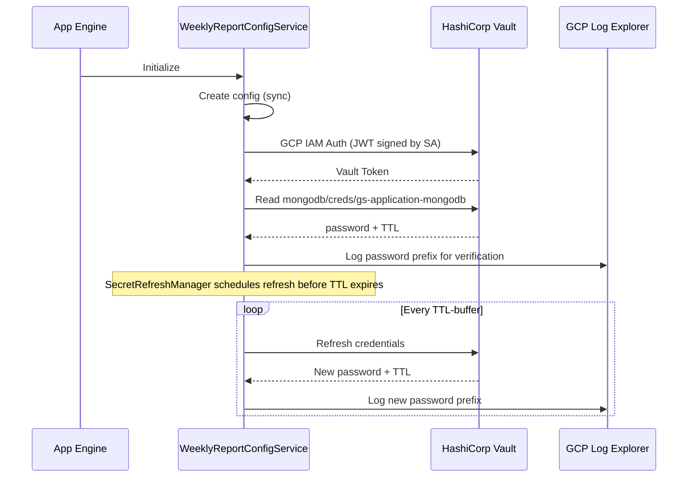

# Vault Dynamic Secrets Integration for Weekly-Report Microservice

## Objective

Test Vault dynamic secrets by fetching a MongoDB Atlas password from Vault using GCP IAM authentication in the weekly-report microservice, and logging it to GCP Log Explorer to verify rotation works correctly.

## Architecture Overview



## Configuration Details

| Setting | Value |

|---------|-------|

| Vault Address | `https://development-cluster-public-vault-ef5c3c60.83c9cf2c.z1.hashicorp.cloud` |

| Vault Namespace | `admin` |

| MongoDB Secret Path | `mongodb/creds/gs-application-mongodb` |

| GCP Service Account | `growthspace-246311@appspot.gserviceaccount.com` (auto-detected) |

| GCP Auth Role | `process.env.VAULT_GCP_ROLE` (get from Dafna before deploy) |

## Files to Modify

1. [gs-backend/microservices/weekly-report/src/services/weekly-report.config.ts](gs-backend/microservices/weekly-report/src/services/weekly-report.config.ts) - Add Vault secret property
2. [gs-backend/microservices/weekly-report/src/services/config.service.ts](gs-backend/microservices/weekly-report/src/services/config.service.ts) - Add Vault configuration and async initialization
3. [gs-backend/microservices/weekly-report/src/app.ts](gs-backend/microservices/weekly-report/src/app.ts) - Convert to async bootstrap with Vault init and logging
4. [gs-backend/microservices/weekly-report/app-production.yaml](gs-backend/microservices/weekly-report/app-production.yaml) - Add Vault environment variables
5. [gs-backend/microservices/weekly-report/package.json](gs-backend/microservices/weekly-report/package.json) - Add required dependencies

---

## Task 1: Add Dependencies

**File:** `package.json`

Add required dependencies for Vault integration:

- `google-auth-library` - For GCP IAM JWT signing
- `node-vault` - Vault client (peer dependency of configit vault)

The configit package should already export the Vault decorators from `@kibibit/configit`.

---

## Task 2: Add Vault Secret Property to Config Model

**File:** `weekly-report.config.ts`

Add a new optional property decorated with Vault decorators:

```typescript
import { VaultPath, VaultEngine, VaultKey, VaultOptional } from '@kibibit/configit';

// Add to WeeklyReportConfig class:
@VaultPath('mongodb/creds/gs-application-mongodb')
@VaultEngine('database')
@VaultKey('password')
@VaultOptional()
@ConfigVariable('Test MongoDB Atlas password from Vault (dynamic secret rotation test)')
@IsOptional()
@IsString()
  VAULT_MONGO_ATLAS_TEST_PASSWORD?: string;
```

Key points:

- `@VaultOptional()` ensures the app doesn't fail if Vault is unavailable
- `@IsOptional()` allows validation to pass before Vault secrets are loaded
- Using `database` engine type for MongoDB Atlas secrets engine

---

## Task 3: Add Vault Configuration to Config Service

**File:** `config.service.ts`

Modify `WeeklyReportConfigService` to include Vault configuration:

```typescript
import { IVaultConfigOptions } from '@kibibit/configit';

// Add Vault config builder function
function buildVaultConfig(): IVaultConfigOptions | undefined {
  const vaultAddr = process.env.VAULT_ADDR;
  const vaultRole = process.env.VAULT_GCP_ROLE;
  
  // Skip Vault if not configured (local dev)
  if (!vaultAddr || !vaultRole) {
    console.log('Vault not configured - VAULT_ADDR or VAULT_GCP_ROLE missing');
    return undefined;
  }
  
  return {
    endpoint: vaultAddr,
    auth: {
      method: 'gcp',
      role: vaultRole
    },
    refreshBuffer: 60, // Refresh 60s before TTL expires
    fallback: {
      required: false,
      useCacheOnFailure: true,
      maxCacheAge: 3600000,
      failFast: false
    }
  };
}
```

Update the constructor to pass vault config to super():

```typescript
super(WeeklyReportConfig, passedConfig, {
  ...options,
  vault: buildVaultConfig(),
  skipSchema: nodeEnv !== 'development'
});
```

Export a method to initialize Vault asynchronously.

---

## Task 4: Convert App to Async Bootstrap with Vault Initialization

**File:** `app.ts`

Convert the app startup to async to properly initialize Vault:

```typescript
async function bootstrap() {
  // Initialize Vault (loads secrets into config)
  try {
    await configService.initializeVault();
    console.log('Vault initialization completed');
  } catch (error) {
    configService.logger.warn({
      type: 'VAULT_INIT_SKIPPED',
      message: 'Vault initialization failed or skipped',
      error: error?.message
    });
  }
  
  // Log the test password for verification (if loaded)
  logVaultTestPassword();
  
  // Start periodic logging (every 5 minutes) to verify rotation
  setInterval(() => logVaultTestPassword(), 5 * 60 * 1000);
  
  // Start Express server
  const service = app.listen(configService.config.PORT, () => {
    console.log(`Started at port ${configService.config.PORT}`);
  });
  service.keepAliveTimeout = 700000;
}

function logVaultTestPassword() {
  const password = configService.config.VAULT_MONGO_ATLAS_TEST_PASSWORD;
  if (password) {
    configService.logger.info({
      type: 'VAULT_DYNAMIC_SECRET_TEST',
      timestamp: new Date().toISOString(),
      passwordLoaded: true,
      passwordLength: password.length,
      // Log first 4 chars only for verification without exposing full secret
      passwordPrefix: password.substring(0, 4) + '****',
      vaultHealth: configService.getVaultHealth()
    });
  } else {
    configService.logger.info({
      type: 'VAULT_DYNAMIC_SECRET_TEST',
      timestamp: new Date().toISOString(),
      passwordLoaded: false,
      message: 'No Vault password loaded'
    });
  }
}

bootstrap();
```

---

## Task 5: Add Environment Variables to Production Config

**File:** `app-production.yaml`

Add Vault-related environment variables:

```yaml
env_variables:
  NODE_ENV: production
  VAULT_ADDR: https://development-cluster-public-vault-ef5c3c60.83c9cf2c.z1.hashicorp.cloud
  VAULT_NAMESPACE: admin
  VAULT_GCP_ROLE: ""  # TODO: Get from Dafna before deploy
```

---

## Task 6: Local Testing Setup

Create a simple test script to verify the config changes work locally (without actual Vault connection):

1. **Without Vault** - Verify app starts normally when `VAULT_ADDR` is not set
2. **With mock values** - Set `VAULT_MONGO_ATLAS_TEST_PASSWORD` as env var to test logging

Local test commands:

```bash
# Test 1: App starts without Vault config
cd microservices/weekly-report
npm run build
NODE_ENV=development npm start

# Test 2: Verify password logging works with mock value
VAULT_MONGO_ATLAS_TEST_PASSWORD=test1234 npm start
```

---

## Verification After Deployment

1. Deploy to test environment (`gs-dafnaassaf-20693112028`) first
2. Check GCP Log Explorer for logs with type `VAULT_DYNAMIC_SECRET_TEST`
3. Verify `passwordPrefix` changes after the TTL expires (rotation working)
4. Monitor for any errors in Vault authentication

---

## Before Deployment Checklist

- [ ] Get `VAULT_GCP_ROLE` from Dafna
- [ ] Confirm MongoDB Atlas secrets engine path is correct
- [ ] Test on `gs-dafnaassaf-20693112028` before production