# Vault Integration Architecture Analysis

**Author**: Systems Architecture Specialist  
**Date**: 2024  
**Status**: Analysis Phase  
**Context**: HashiCorp Vault integration for Configit TypeScript configuration library

---

## Executive Summary

This document analyzes the architectural feasibility of integrating HashiCorp Vault into Configit, a TypeScript configuration library that validates app configuration against schemas using decorators. The integration requires:

1. **Dynamic secrets** with TTL management (background refresh, sync API)
2. **Multi-storage engine support** (different Vault paths per config attribute)
3. **Multiple auth methods** (IAM, AppRole, Token, etc.)

**Key Finding**: The integration is **architecturally feasible** but requires careful design to maintain Configit's synchronous API while managing asynchronous Vault operations. A hybrid approach using background refresh with synchronous cache access is recommended.

---

## Table of Contents

1. [Current Architecture Review](#current-architecture-review)
2. [Vault Integration Patterns Research](#vault-integration-patterns-research)
3. [Key Architectural Decisions](#key-architectural-decisions)
4. [Proposed Architecture](#proposed-architecture)
5. [Technical Specifications](#technical-specifications)
6. [One-Way Door Decisions](#one-way-door-decisions)
7. [Risk Assessment](#risk-assessment)
8. [Implementation Recommendations](#implementation-recommendations)

---

## Current Architecture Review

### ConfigService Architecture

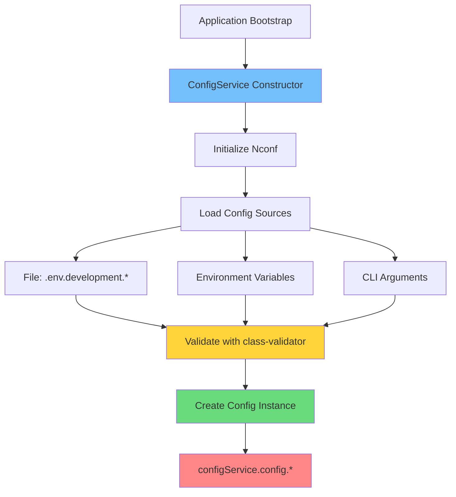

**Key Characteristics**:

1. **Forced Singleton Pattern**: Only one ConfigService instance per process
2. **Synchronous API**: All config access is synchronous (`configService.config.PORT`)
3. **Multi-source Loading**: Uses `nconf` hierarchy (argv → env → file)
4. **Validation**: Uses `class-validator` decorators for runtime validation
5. **Schema Generation**: Auto-generates JSON schemas from decorators
6. **File Formats**: Supports JSON, YAML, JSONC, HJSON

### BaseConfig Architecture

```mermaid
graph LR
    A[@Configuration Decorator] --> B[BaseConfig Class]
    B --> C[@ConfigVariable Decorator]
    C --> D[Property with Validation]
    D --> E[class-validator Decorators]
    E --> F[IsString, IsNumber, etc.]
    
    style A fill:#74c0fc
    style C fill:#ffd43b
    style E fill:#69db7c
```

**Key Characteristics**:

1. **Decorator-based**: Uses TypeScript decorators for metadata
2. **Validation Integration**: Works with `class-validator` decorators
3. **Schema Generation**: Converts decorators to JSON Schema
4. **Inheritance Model**: Config classes extend `BaseConfig`

### Current Data Flow

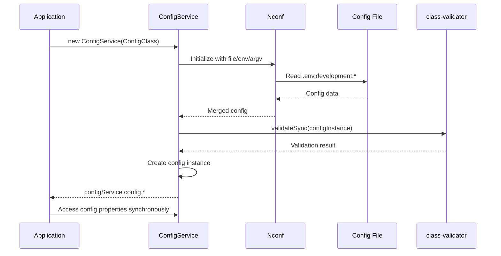

---

## Vault Integration Patterns Research

### HashiCorp Vault Overview

Vault is a secrets management system that provides:

1. **Static Secrets**: KV (Key-Value) stores (v1 and v2)
2. **Dynamic Secrets**: Time-limited credentials (databases, AWS, etc.)
3. **Secrets Engines**: Pluggable backends (KV, Database, AWS, Azure, etc.)
4. **Authentication Methods**: Token, AppRole, AWS IAM, Kubernetes, etc.
5. **Lease Management**: TTL (Time To Live) and renewal for dynamic secrets

### node-vault Library Analysis

The `node-vault` library provides:

```typescript
// Basic usage pattern
const vault = require('node-vault')({
  endpoint: 'http://127.0.0.1:8200',
  token: 'myroot'
});

// KV v2 read
const secret = await vault.read('secret/data/myapp');

// Dynamic secret (database)
const dbCreds = await vault.read('database/creds/my-role');
// Returns: { lease_id, lease_duration, data: { username, password } }
```

**Key Characteristics**:
- **Async by default**: All operations return Promises
- **Lease management**: Dynamic secrets include `lease_id` and `lease_duration`
- **Token management**: Handles token renewal automatically
- **Multiple auth methods**: Supports AppRole, AWS IAM, Kubernetes, etc.

### Vault Secrets Engines

#### 1. KV Secrets Engine (v1 and v2)

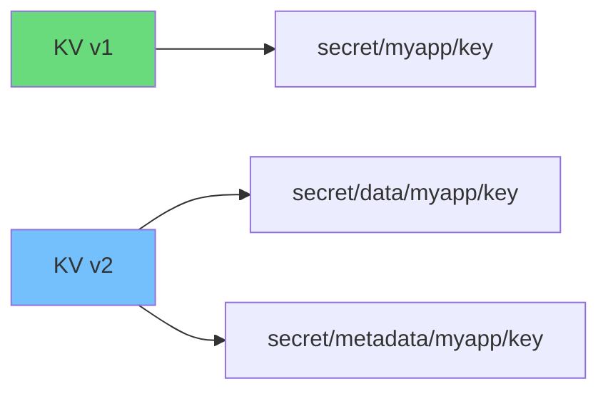

- **v1**: Simple key-value store
- **v2**: Versioned with metadata, supports check-and-set operations
- **Use case**: Static secrets, API keys, certificates

#### 2. Database Secrets Engine

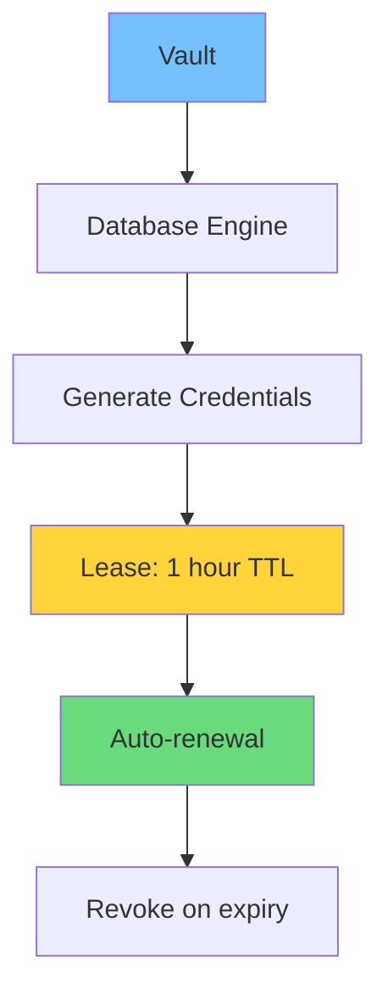

- **Dynamic credentials**: Generates time-limited database users
- **Lease management**: Requires renewal before TTL expiry
- **Use case**: Database connections, rotating credentials

#### 3. AWS Secrets Engine

- Generates temporary AWS credentials
- Supports IAM roles and STS tokens
- **Use case**: Cloud resource access

### Vault Authentication Methods

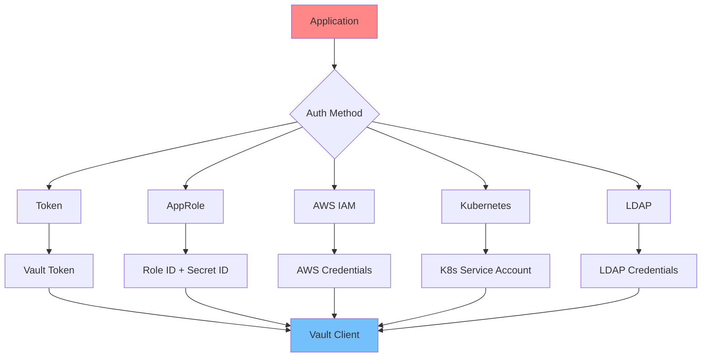

**Recommended for Configit**:
- **AppRole**: Best for applications (role_id + secret_id)
- **AWS IAM**: For AWS-hosted applications
- **Token**: For development/testing (not production)

---

## Key Architectural Decisions

### Decision 1: Synchronous API vs Async Vault Operations

**Problem**: Configit's API is synchronous (`configService.config.PORT`), but Vault operations are async.

**Options**:

#### Option A: Background Refresh with Synchronous Cache (RECOMMENDED)

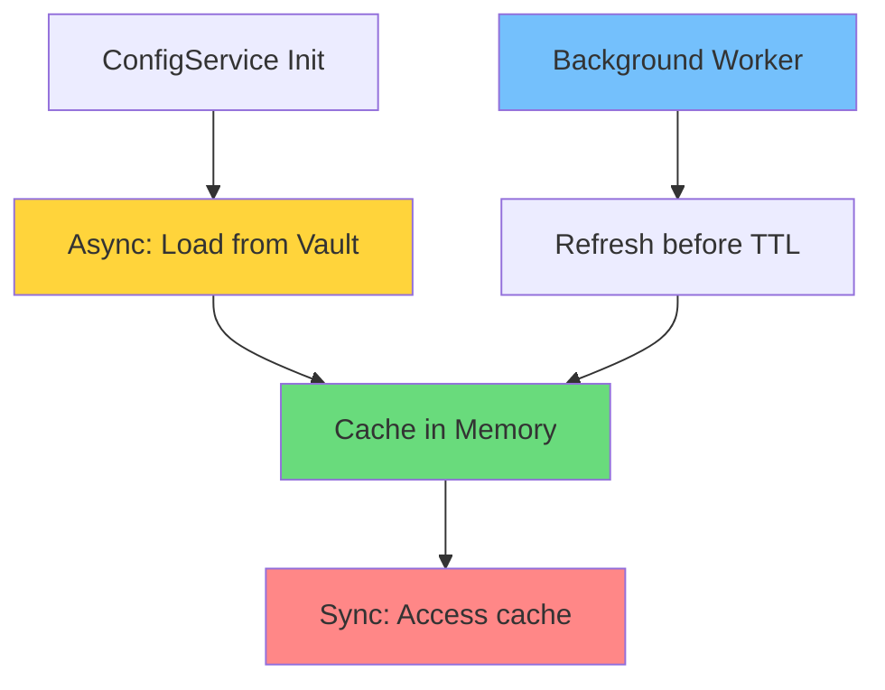

**Pros**:
- Maintains existing synchronous API
- Non-blocking initialization possible
- Background refresh ensures freshness
- Simple for consumers

**Cons**:
- Initial load may be incomplete
- Requires cache invalidation logic
- Error handling complexity

**Implementation**:
```typescript
class VaultConfigService<T extends BaseConfig> extends ConfigService<T> {
  private vaultCache: Map<string, VaultSecret>;
  private refreshWorker: NodeJS.Timeout;
  
  async initializeVault(): Promise<void> {
    // Load secrets asynchronously
    await this.loadSecretsFromVault();
    // Start background refresh
    this.startRefreshWorker();
  }
  
  // Synchronous access to cache
  get config(): T {
    return this.cachedConfig; // Synchronous
  }
}
```

#### Option B: Async API

**Pros**:
- Natural fit with Vault's async nature
- No caching complexity
- Real-time secret access

**Cons**:
- **BREAKING CHANGE**: Requires all consumers to use async/await
- Significant API change
- Not compatible with current usage patterns

**Verdict**: **Option A is recommended** - maintains backward compatibility while enabling Vault integration.

### Decision 2: Secret Refresh Strategy

**Problem**: Dynamic secrets expire. How to refresh before TTL expiry?

**Strategy**: **Proactive Refresh with Buffer**


**Algorithm**:
1. Load secret with TTL
2. Calculate refresh time: `refreshTime = now + (TTL - buffer)`
3. Schedule refresh at `refreshTime`
4. On refresh, update cache and reschedule

**Buffer Selection**:
- **Default**: 5 minutes (300s) or 10% of TTL, whichever is smaller
- **Configurable**: Allow override via options
- **Rationale**: Prevents race conditions and network delays

**Implementation**:
```typescript
interface VaultSecret {
  value: any;
  leaseId?: string;
  leaseDuration: number;
  refreshAt: number; // Timestamp
}

class SecretRefreshManager {
  private secrets: Map<string, VaultSecret> = new Map();
  private timers: Map<string, NodeJS.Timeout> = new Map();
  
  scheduleRefresh(path: string, secret: VaultSecret): void {
    const buffer = Math.min(secret.leaseDuration * 0.1, 300);
    const refreshAt = Date.now() + (secret.leaseDuration - buffer) * 1000;
    
    const timer = setTimeout(() => {
      this.refreshSecret(path);
    }, refreshAt - Date.now());
    
    this.timers.set(path, timer);
  }
}
```

### Decision 3: Decorator-to-Vault-Path Mapping

**Problem**: How to map `@ConfigVariable` decorators to Vault paths?

**Options**:

#### Option A: Decorator Metadata (RECOMMENDED)

```typescript
@ConfigVariable('Database password', {
  vault: {
    path: 'database/creds/my-role',
    engine: 'database',
    key: 'password' // For KV engines
  }
})
@IsString()
DATABASE_PASSWORD: string;
```

**Pros**:
- Explicit mapping
- Type-safe
- Supports multiple engines
- Clear intent

**Cons**:
- Requires decorator changes
- More verbose

#### Option B: Convention-Based Mapping

```typescript
// Convention: vault:secret/data/{app}/{key}
@ConfigVariable('Database password')
@IsString()
DATABASE_PASSWORD: string; // Maps to vault:secret/data/myapp/database_password
```

**Pros**:
- Less verbose
- No decorator changes needed

**Cons**:
- Less flexible
- Harder to support multiple engines
- Magic behavior

**Verdict**: **Option A is recommended** - explicit is better than implicit, especially for security.

**Implementation**:
```typescript
interface IVaultConfigOptions {
  path: string; // Full Vault path
  engine?: 'kv-v1' | 'kv-v2' | 'database' | 'aws' | 'custom';
  key?: string; // For KV engines, the key name
  refreshBuffer?: number; // Override default refresh buffer
}

function ConfigVariable(
  description: string | string[],
  options: IConfigVariableOptions & { vault?: IVaultConfigOptions } = {}
): PropertyDecorator {
  // Store vault metadata in decorator
}
```

### Decision 4: Caching Strategy

**Problem**: How to cache Vault secrets efficiently?

**Strategy**: **In-Memory Cache with Per-Secret TTL**

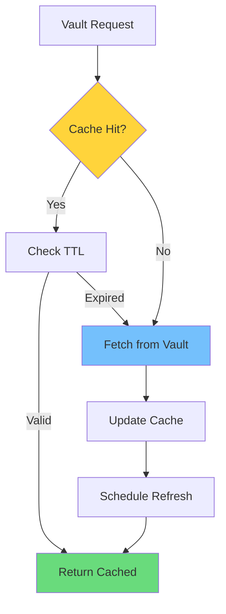

**Cache Structure**:
```typescript
interface VaultCacheEntry {
  secret: VaultSecret;
  cachedAt: number;
  expiresAt: number;
  refreshScheduled: boolean;
}

class VaultCache {
  private cache: Map<string, VaultCacheEntry> = new Map();
  
  get(path: string): VaultSecret | null {
    const entry = this.cache.get(path);
    if (!entry) return null;
    
    if (Date.now() > entry.expiresAt) {
      this.cache.delete(path);
      return null;
    }
    
    return entry.secret;
  }
  
  set(path: string, secret: VaultSecret): void {
    this.cache.set(path, {
      secret,
      cachedAt: Date.now(),
      expiresAt: Date.now() + secret.leaseDuration * 1000,
      refreshScheduled: false
    });
  }
}
```

**Cache Invalidation**:
- **TTL-based**: Automatic expiration
- **Manual**: `configService.invalidateVaultCache(path)`
- **On error**: Invalidate on Vault errors to force refresh

---

## Proposed Architecture

### High-Level Architecture

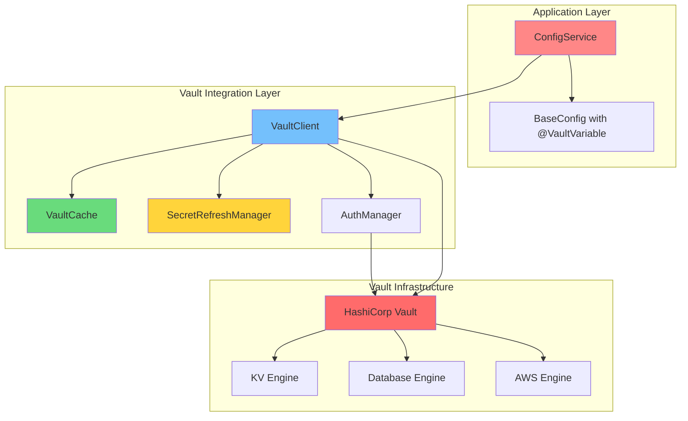

### Component Architecture

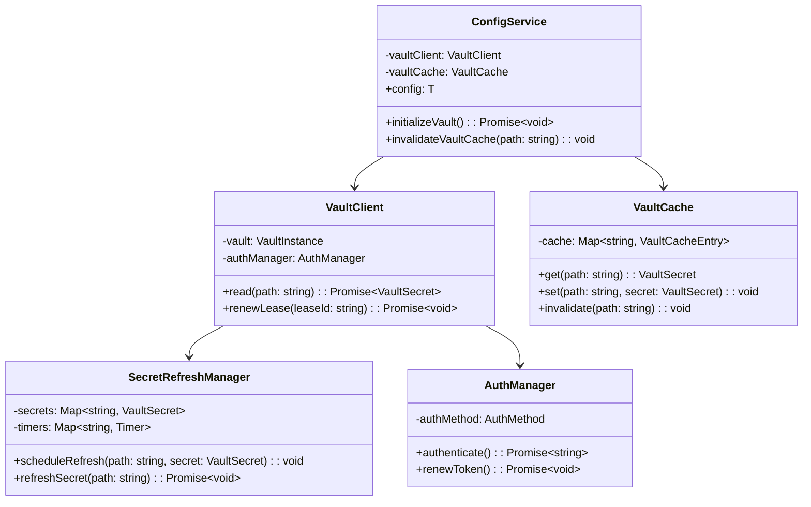

### Data Flow: Initialization

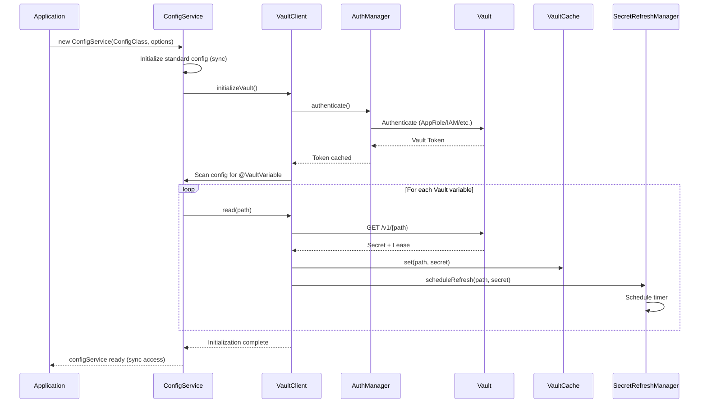

### Data Flow: Secret Refresh

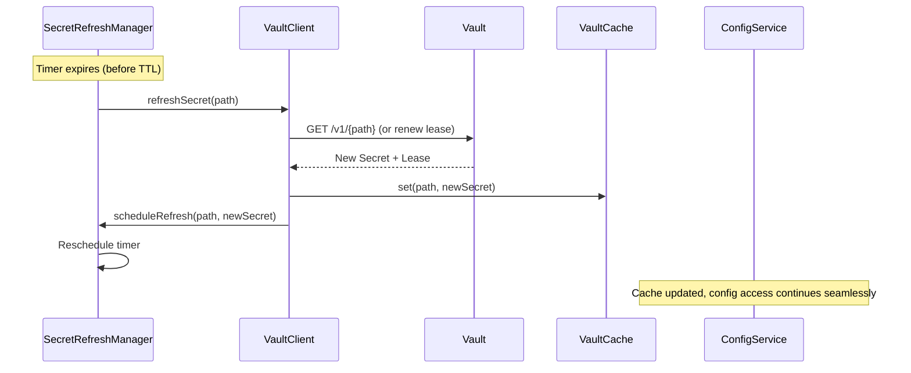

### Data Flow: Synchronous Access

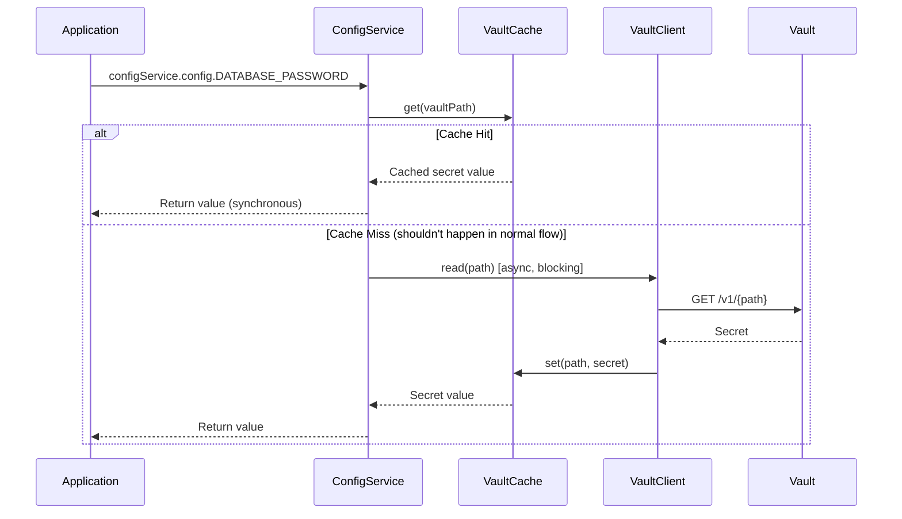

---

## Technical Specifications

### API Design

#### ConfigService Extensions

```typescript
interface IVaultConfigServiceOptions extends IConfigServiceOptions {
  vault?: {
    endpoint: string;
    auth: {
      method: 'token' | 'approle' | 'aws' | 'kubernetes';
      config: Record<string, any>;
    };
    refreshBuffer?: number; // Default: 300s or 10% of TTL
    cacheEnabled?: boolean; // Default: true
  };
}

class ConfigService<T extends BaseConfig> {
  // Existing methods...
  
  /**
   * Initialize Vault integration (async)
   * Call this after constructor if using Vault
   */
  async initializeVault(): Promise<void>;
  
  /**
   * Invalidate Vault cache for a specific path
   */
  invalidateVaultCache(path: string): void;
  
  /**
   * Invalidate all Vault caches
   */
  invalidateAllVaultCaches(): void;
  
  /**
   * Get Vault secret directly (for advanced use cases)
   */
  async getVaultSecret(path: string): Promise<VaultSecret>;
}
```

#### Decorator Extensions

```typescript
interface IVaultConfigOptions {
  /**
   * Full Vault path (e.g., 'secret/data/myapp/db_password')
   */
  path: string;
  
  /**
   * Secrets engine type
   */
  engine?: 'kv-v1' | 'kv-v2' | 'database' | 'aws' | 'azure' | 'gcp';
  
  /**
   * Key name for KV engines (defaults to property name)
   */
  key?: string;
  
  /**
   * Override default refresh buffer (seconds)
   */
  refreshBuffer?: number;
  
  /**
   * Whether to fail if Vault is unavailable (default: true)
   */
  required?: boolean;
}

function ConfigVariable(
  description: string | string[],
  options: IConfigVariableOptions & { vault?: IVaultConfigOptions } = {}
): PropertyDecorator;
```

#### Usage Example

```typescript
import { BaseConfig, Configuration, ConfigVariable } from '@kibibit/configit';
import { IsString, IsNumber } from 'class-validator';

@Configuration()
export class AppConfig extends BaseConfig {
  @ConfigVariable('Database host', {
    vault: {
      path: 'secret/data/myapp/database',
      engine: 'kv-v2',
      key: 'host'
    }
  })
  @IsString()
  DATABASE_HOST: string;
  
  @ConfigVariable('Database credentials', {
    vault: {
      path: 'database/creds/my-role',
      engine: 'database'
      // For dynamic secrets, the entire response is used
    }
  })
  DATABASE_PASSWORD: string; // Extracted from secret.data.password
}
```

### VaultClient Implementation

```typescript
import vault from 'node-vault';

interface VaultSecret {
  data: Record<string, any>;
  leaseId?: string;
  leaseDuration: number; // Seconds
  renewable: boolean;
}

class VaultClient {
  private client: any;
  private authManager: AuthManager;
  private cache: VaultCache;
  private refreshManager: SecretRefreshManager;
  
  constructor(options: IVaultOptions) {
    this.client = vault({
      endpoint: options.endpoint,
      // Token will be set by authManager
    });
    this.authManager = new AuthManager(this.client, options.auth);
    this.cache = new VaultCache();
    this.refreshManager = new SecretRefreshManager(this);
  }
  
  async initialize(): Promise<void> {
    await this.authManager.authenticate();
    // Set token on client
    this.client.token = this.authManager.getToken();
  }
  
  async read(path: string): Promise<VaultSecret> {
    // Check cache first
    const cached = this.cache.get(path);
    if (cached) {
      return cached;
    }
    
    // Fetch from Vault
    const response = await this.client.read(path);
    
    const secret: VaultSecret = {
      data: response.data?.data || response.data, // Handle KV v2 nesting
      leaseId: response.lease_id,
      leaseDuration: response.lease_duration || 0,
      renewable: response.renewable || false
    };
    
    // Cache and schedule refresh
    this.cache.set(path, secret);
    if (secret.leaseDuration > 0) {
      this.refreshManager.scheduleRefresh(path, secret);
    }
    
    return secret;
  }
  
  async renewLease(leaseId: string): Promise<void> {
    await this.client.write(`sys/leases/renew`, { lease_id: leaseId });
  }
}
```

### AuthManager Implementation

```typescript
interface AuthConfig {
  method: 'token' | 'approle' | 'aws' | 'kubernetes';
  config: Record<string, any>;
}

class AuthManager {
  private client: any;
  private authConfig: AuthConfig;
  private token: string | null = null;
  private tokenRenewTimer: NodeJS.Timeout | null = null;
  
  constructor(client: any, authConfig: AuthConfig) {
    this.client = client;
    this.authConfig = authConfig;
  }
  
  async authenticate(): Promise<string> {
    switch (this.authConfig.method) {
      case 'token':
        this.token = this.authConfig.config.token;
        break;
        
      case 'approle':
        const roleResponse = await this.client.approleLogin({
          role_id: this.authConfig.config.roleId,
          secret_id: this.authConfig.config.secretId
        });
        this.token = roleResponse.auth.client_token;
        break;
        
      case 'aws':
        const awsResponse = await this.client.awsIamLogin({
          role: this.authConfig.config.role,
          iam_request_url: this.authConfig.config.iamRequestUrl,
          iam_request_body: this.authConfig.config.iamRequestBody,
          iam_request_headers: this.authConfig.config.iamRequestHeaders
        });
        this.token = awsResponse.auth.client_token;
        break;
        
      case 'kubernetes':
        const k8sResponse = await this.client.kubernetesLogin({
          role: this.authConfig.config.role,
          jwt: this.authConfig.config.jwt
        });
        this.token = k8sResponse.auth.client_token;
        break;
    }
    
    // Schedule token renewal if TTL provided
    if (this.authConfig.config.tokenTTL) {
      this.scheduleTokenRenewal();
    }
    
    return this.token;
  }
  
  getToken(): string {
    if (!this.token) {
      throw new Error('Not authenticated. Call authenticate() first.');
    }
    return this.token;
  }
  
  private scheduleTokenRenewal(): void {
    // Renew token before expiry
    const ttl = this.authConfig.config.tokenTTL || 3600;
    const buffer = 300; // 5 minutes
    const renewAt = (ttl - buffer) * 1000;
    
    this.tokenRenewTimer = setTimeout(async () => {
      await this.renewToken();
    }, renewAt);
  }
  
  private async renewToken(): Promise<void> {
    // Token renewal logic depends on auth method
    // For AppRole, re-authenticate
    // For others, use token renewal endpoint
    await this.authenticate();
  }
}
```

---

## One-Way Door Decisions

### Decision 1: Synchronous API Preservation

**Decision**: Maintain synchronous API (`configService.config.*`) while using async Vault operations internally.

**Reversibility**: **HIGH COST** - Changing to async API would break all existing consumers.

**Rationale**: 
- Backward compatibility is critical
- Background refresh pattern is proven (used by Vault Agent)
- Consumers expect synchronous access

**Mitigation**: 
- Document async initialization requirement
- Provide clear error messages if Vault not initialized
- Consider future async API as opt-in enhancement

### Decision 2: Decorator-Based Vault Mapping

**Decision**: Use decorator metadata to map config properties to Vault paths.

**Reversibility**: **MEDIUM COST** - Changing would require decorator updates but not API changes.

**Rationale**:
- Explicit is better than implicit for security
- Supports multiple engines
- Type-safe

**Mitigation**:
- Provide convention-based fallback option
- Document patterns clearly

### Decision 3: In-Memory Caching

**Decision**: Cache Vault secrets in memory with TTL-based expiration.

**Reversibility**: **LOW COST** - Can add persistent caching later.

**Rationale**:
- Simple implementation
- Fast access
- Sufficient for most use cases

**Future Evolution**:
- Add Redis cache for multi-process scenarios
- Add file-based cache for development
- Add cache persistence for resilience

### Decision 4: Background Refresh Pattern

**Decision**: Use background workers to refresh secrets before TTL expiry.

**Reversibility**: **MEDIUM COST** - Alternative would be on-demand refresh with blocking.

**Rationale**:
- Prevents expired secret access
- Non-blocking
- Industry standard pattern (Vault Agent)

**Mitigation**:
- Make refresh buffer configurable
- Provide manual refresh API
- Handle refresh failures gracefully

---

## Risk Assessment

### High Risk

1. **Vault Unavailability During Startup**
   - **Impact**: Application cannot start
   - **Mitigation**: 
     - Make Vault optional (fallback to env vars)
     - Provide `required: false` option for non-critical secrets
     - Implement retry logic with exponential backoff

2. **Secret Expiration During Runtime**
   - **Impact**: Application fails when accessing expired secret
   - **Mitigation**:
     - Proactive refresh before TTL expiry
     - Refresh buffer to handle network delays
     - Fallback to cached value if refresh fails (with warning)

3. **Token Expiration**
   - **Impact**: Cannot authenticate to Vault
   - **Mitigation**:
     - Automatic token renewal
     - Re-authentication on token expiry
     - Health checks and monitoring

### Medium Risk

1. **Cache Inconsistency**
   - **Impact**: Stale secrets in multi-process scenarios
   - **Mitigation**:
     - Document single-process limitation
     - Future: Redis cache for multi-process

2. **Performance Impact**
   - **Impact**: Slower startup due to Vault calls
   - **Mitigation**:
     - Parallel secret loading
     - Cache warm-up
     - Lazy loading option

3. **Error Handling Complexity**
   - **Impact**: Difficult to debug Vault-related issues
   - **Mitigation**:
     - Comprehensive error messages
     - Logging and monitoring hooks
     - Health check endpoints

### Low Risk

1. **Decorator Complexity**
   - **Impact**: More verbose config definitions
   - **Mitigation**: Provide helper functions and examples

2. **Memory Usage**
   - **Impact**: Cached secrets consume memory
   - **Mitigation**: TTL-based expiration, cache size limits

---

## Implementation Recommendations

### Phase 1: Core Vault Integration (MVP)

**Scope**:
- Basic Vault client integration
- KV v2 engine support
- Token authentication
- In-memory caching
- Background refresh

**Deliverables**:
- `VaultClient` class
- `VaultCache` class
- `SecretRefreshManager` class
- `@VaultVariable` decorator (or extend `@ConfigVariable`)
- ConfigService extensions

**Success Criteria**:
- Can load secrets from Vault KV v2
- Secrets refresh before TTL expiry
- Synchronous API maintained
- Basic error handling

### Phase 2: Multi-Engine Support

**Scope**:
- Database secrets engine
- AWS secrets engine
- KV v1 support
- Multiple auth methods (AppRole, AWS IAM)

**Deliverables**:
- Engine-specific adapters
- Auth method implementations
- Enhanced error handling

### Phase 3: Advanced Features

**Scope**:
- Lease renewal optimization
- Health checks
- Metrics and monitoring
- Development mode (mock Vault)
- Multi-process cache (Redis)

**Deliverables**:
- Health check API
- Metrics collection
- Redis cache adapter
- Mock Vault for testing

### Implementation Order

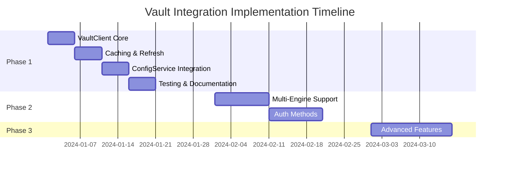

---

## Technology Stack Recommendations

### Required Dependencies

```json
{
  "dependencies": {
    "node-vault": "^0.9.22"
  },
  "devDependencies": {
    "@types/node-vault": "^0.9.5"
  }
}
```

### Optional Dependencies (Future)

```json
{
  "optionalDependencies": {
    "ioredis": "^5.3.2" // For multi-process caching
  }
}
```

### Testing Strategy

1. **Unit Tests**: Mock Vault client, test caching and refresh logic
2. **Integration Tests**: Use Vault Dev Server for real Vault testing
3. **E2E Tests**: Full application bootstrap with Vault

---

## Performance Considerations

### Startup Performance

- **Parallel Loading**: Load all Vault secrets in parallel during initialization
- **Lazy Loading**: Option to load secrets on first access (not recommended for required secrets)
- **Cache Warm-up**: Pre-populate cache during initialization

### Runtime Performance

- **Cache Hit Rate**: Target >99% cache hit rate (secrets refreshed proactively)
- **Memory Usage**: Monitor cache size, implement LRU eviction if needed
- **Network Calls**: Minimize Vault API calls through caching

### Scalability

- **Single Process**: Current design supports single-process applications
- **Multi-Process**: Future enhancement with Redis cache
- **Horizontal Scaling**: Each process maintains its own cache (acceptable for most use cases)

---

## Security Considerations

### Authentication

- **Never log tokens**: Ensure tokens are never logged
- **Secure storage**: Use environment variables or secure config for auth credentials
- **Token rotation**: Implement automatic token renewal

### Secret Handling

- **Memory security**: Secrets stored in memory (consider secure memory options)
- **No persistence**: Don't persist secrets to disk
- **Clear on exit**: Clear cache on process exit

### Error Handling

- **No secret leakage**: Ensure errors don't expose secret values
- **Secure logging**: Don't log secret values in error messages

---

## Monitoring and Observability

### Metrics to Track

- Vault API call count and latency
- Cache hit/miss rates
- Secret refresh success/failure rates
- Token renewal success/failure
- Error rates by type

### Logging

- Vault initialization events
- Secret refresh events
- Authentication events
- Error events (without sensitive data)

### Health Checks

```typescript
interface VaultHealth {
  connected: boolean;
  authenticated: boolean;
  cacheSize: number;
  refreshQueueSize: number;
  lastRefreshTime: number;
}

configService.getVaultHealth(): VaultHealth;
```

---

## Conclusion

The integration of HashiCorp Vault into Configit is **architecturally feasible** with the following key design decisions:

1. **Synchronous API with async internals**: Maintains backward compatibility while enabling Vault integration
2. **Background refresh pattern**: Proactive secret renewal before TTL expiry
3. **Decorator-based mapping**: Explicit, type-safe Vault path configuration
4. **In-memory caching**: Simple, fast secret access with TTL-based expiration

**Next Steps**:
1. Review and approve architecture
2. Implement Phase 1 (MVP)
3. Test with real Vault instance
4. Iterate based on feedback

**Open Questions**:
1. Should Vault be optional or required?
2. What's the fallback strategy if Vault is unavailable?
3. Should we support Vault Agent integration (alternative to direct Vault access)?

---

## Appendix

### A. Vault Path Examples

```
# KV v2
secret/data/myapp/database/host
secret/data/myapp/database/password

# Database Engine
database/creds/my-role

# AWS Engine
aws/creds/my-role
```

### B. Error Scenarios

1. **Vault Unavailable**: Retry with exponential backoff, fallback to env vars
2. **Authentication Failure**: Log error, fail fast
3. **Secret Not Found**: Log warning, use default if provided
4. **Token Expired**: Re-authenticate automatically
5. **Refresh Failure**: Use cached value with warning, retry refresh

### C. Testing Considerations

- Use Vault Dev Server for integration tests
- Mock Vault client for unit tests
- Test error scenarios (network failures, auth failures, etc.)
- Test refresh timing and TTL handling
- Test cache invalidation

---

**Document Version**: 1.0  
**Last Updated**: 2024  
**Status**: Ready for Review
