# Vault Integration Architecture Design

**Author**: Backend Architecture Specialist  
**Date**: 2024  
**Status**: Architecture Design Phase  
**Context**: HashiCorp Vault integration for Configit TypeScript configuration library

---

## Executive Summary

This document provides the detailed architecture design for integrating HashiCorp Vault as an optional secrets source into Configit. The design maintains Configit's synchronous API while managing asynchronous Vault operations through background refresh and in-memory caching.

**Key Design Principles**:
1. **Source Priority**: Vault (if configured) → Environment Variables → Config Files
2. **Synchronous API**: Maintain `configService.config.*` synchronous access
3. **Background Operations**: Async Vault operations handled behind the scenes
4. **Security First**: All security requirements from security analysis implemented
5. **Graceful Degradation**: Fallback strategies when Vault is unavailable

---

## Table of Contents

1. [Source Hierarchy Design](#source-hierarchy-design)
2. [VaultProvider Component Design](#vaultprovider-component-design)
3. [TTL/Refresh Manager Design](#ttlrefresh-manager-design)
4. [ConfigService Integration Design](#configservice-integration-design)
5. [Component Diagrams](#component-diagrams)
6. [Sequence Diagrams](#sequence-diagrams)
7. [Interface Definitions](#interface-definitions)
8. [Error Handling Strategies](#error-handling-strategies)
9. [Configuration Schema](#configuration-schema)
10. [Implementation Phases](#implementation-phases)

---

## Source Hierarchy Design

### Current nconf Hierarchy

Configit currently uses nconf with the following source hierarchy (highest to lowest priority):

```
argv (CLI arguments)
  ↓
env (Environment Variables)
  ↓
file (Config Files: .env.development.*)
```

### Proposed Vault-Integrated Hierarchy

With Vault integration, the hierarchy becomes:

```
Vault (if configured) ← NEW
  ↓
argv (CLI arguments)
  ↓
env (Environment Variables)
  ↓
file (Config Files: .env.development.*)
```

### Implementation Strategy

**Challenge**: nconf doesn't natively support async sources, and Vault operations are async.

**Solution**: Hybrid approach using a Vault cache layer that integrates with nconf:

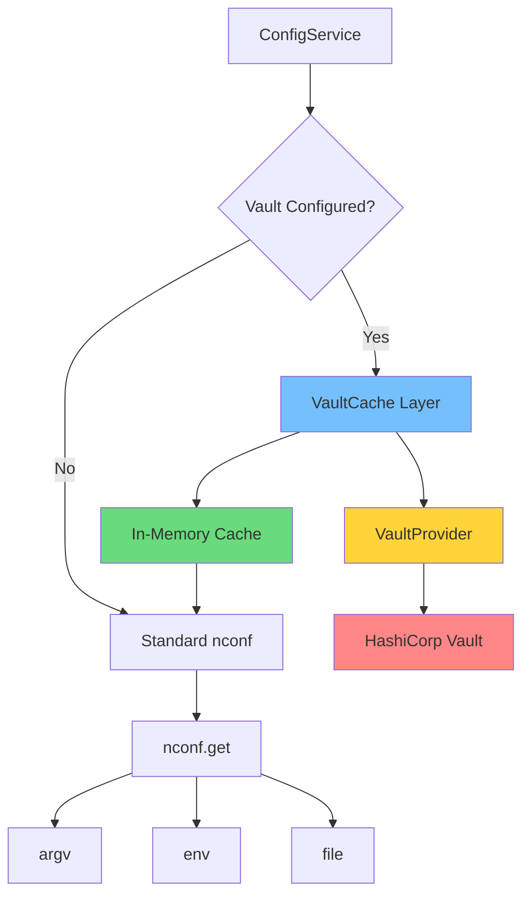

### Vault Cache Integration with nconf

Instead of adding Vault as a native nconf source (which would require async support), we'll:

1. **Pre-populate cache**: Load Vault secrets during async initialization
2. **Inject into nconf**: Use nconf's `overrides()` API to inject Vault values
3. **Background refresh**: Update nconf overrides when secrets refresh

**Implementation Flow**:

```typescript
class ConfigService<T extends BaseConfig> {
  private vaultCache: VaultCache | null = null;
  private vaultOverrides: Map<string, any> = new Map();
  
  async initializeVault(): Promise<void> {
    if (!this.vaultConfig) return;
    
    // Initialize Vault client
    this.vaultCache = new VaultCache(this.vaultConfig);
    await this.vaultCache.initialize();
    
    // Load secrets for properties marked with @VaultVariable
    const vaultSecrets = await this.loadVaultSecrets();
    
    // Inject into nconf using overrides (highest priority)
    for (const [key, value] of Object.entries(vaultSecrets)) {
      this.vaultOverrides.set(key, value);
      nconf.overrides({ [key]: value });
    }
    
    // Start background refresh
    this.vaultCache.startRefreshWorker();
  }
}
```

### Mixed Source Handling

**Scenario**: Some properties come from Vault, others from env/files.

**Solution**: 
- Properties with `@ConfigVariable({ vault: {...} })` → Load from Vault
- Properties without vault config → Use standard nconf hierarchy
- Vault values override env/file values via nconf overrides

**Example**:
```typescript
@Configuration()
class AppConfig extends BaseConfig {
  // From Vault
  @ConfigVariable('DB password', { vault: { path: 'secret/data/myapp/db' } })
  DATABASE_PASSWORD: string;
  
  // From env/file (standard)
  @ConfigVariable('DB host')
  DATABASE_HOST: string;
}
```

### Fallback Strategy

**When Vault is unavailable**:

1. **Initialization Failure**:
   - If `required: false` → Fallback to env/file, log warning
   - If `required: true` (default) → Fail fast with clear error

2. **Runtime Failure**:
   - Use cached value if available and within max age
   - Log error and continue with stale secret (if allowed)
   - Fail if no cache or cache expired

**Configuration**:
```typescript
interface VaultFallbackConfig {
  required: boolean;           // Default: true
  useCacheOnFailure: boolean;  // Default: true
  maxCacheAge: number;         // Default: TTL or 1 hour
  failFast: boolean;           // Default: true for required secrets
}
```

---

## VaultProvider Component Design

### Component Responsibilities

The `VaultProvider` is responsible for:
1. **Connection Management**: Establishing and maintaining Vault connections
2. **Authentication**: Handling multiple auth methods with priority
3. **Secret Fetching**: Reading secrets from various Vault engines
4. **Error Handling**: Retries, circuit breakers, graceful degradation
5. **Token Management**: Automatic token renewal

### Authentication Method Priority

As specified in requirements:
1. **GCP IAM** (highest priority)
2. **AWS IAM**
3. **AppRole**
4. **Token** (lowest priority, dev only)

### Component Architecture

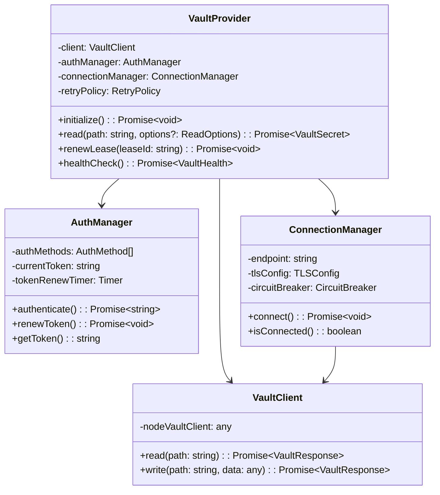

### Authentication Flow

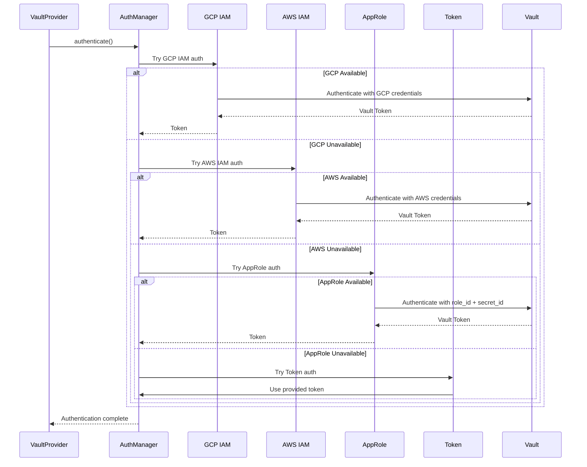

### Secret Engine Support

**Supported Engines**:

1. **KV v1**: `secret/myapp/key`
2. **KV v2**: `secret/data/myapp/key` (with metadata)
3. **Database**: `database/creds/my-role` (dynamic secrets)
4. **AWS**: `aws/creds/my-role` (dynamic AWS credentials)
5. **GCP**: `gcp/keyrings/my-keyring/keys/my-key` (GCP secrets)

**Engine Detection**:
- Auto-detect based on path pattern
- Explicit engine type via decorator options
- Fallback to KV v2 if ambiguous

### Connection Management

**TLS Requirements** (from security analysis):
- **REQUIRED**: TLS enabled (no HTTP allowed)
- **REQUIRED**: Certificate validation
- **RECOMMENDED**: Certificate pinning

**Connection Pooling**:
- Reuse HTTP connections
- Connection timeout: 10s
- Request timeout: 30s

**Circuit Breaker**:
- Failure threshold: 5 consecutive failures
- Reset timeout: 60s
- Half-open state: Allow 1 test request

### Error Handling & Retries

**Retry Strategy**:
```typescript
interface RetryPolicy {
  maxAttempts: number;        // Default: 3
  backoff: {
    strategy: 'exponential' | 'linear' | 'fixed';
    initial: number;          // Default: 1000ms
    max: number;              // Default: 10000ms
    multiplier: number;       // Default: 2 (for exponential)
  };
  retryableErrors: string[];  // ['ECONNREFUSED', 'ETIMEDOUT', '5xx']
}
```

**Error Classification**:
- **Retryable**: Network errors, 5xx responses, timeouts
- **Non-retryable**: 4xx (except 429), authentication failures
- **Rate limiting**: 429 responses → Exponential backoff

---

## TTL/Refresh Manager Design

### Component Responsibilities

The `SecretRefreshManager` handles:
1. **TTL Tracking**: Monitor lease durations for each secret
2. **Refresh Scheduling**: Schedule refreshes before TTL expiry
3. **Concurrent Refresh Prevention**: Lock mechanism to prevent race conditions
4. **Refresh Failure Handling**: Retry logic and fallback strategies

### Refresh Algorithm

**Proactive Refresh with Buffer**:

```
Refresh Time = Current Time + (TTL - Refresh Buffer)

Where:
- Refresh Buffer = min(10% of TTL, 300 seconds)
- Example: TTL = 3600s → Refresh at 3300s (5 min before expiry)
```

### Component Architecture

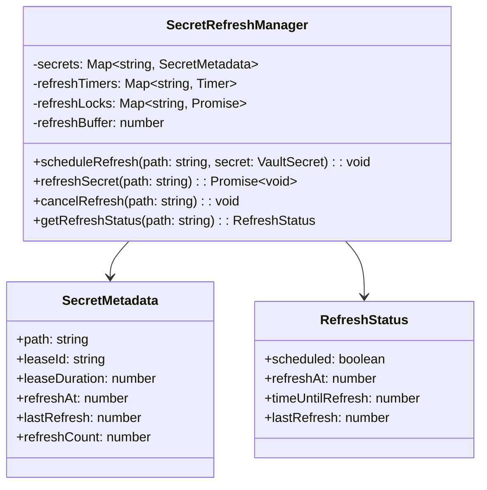

### Refresh Flow

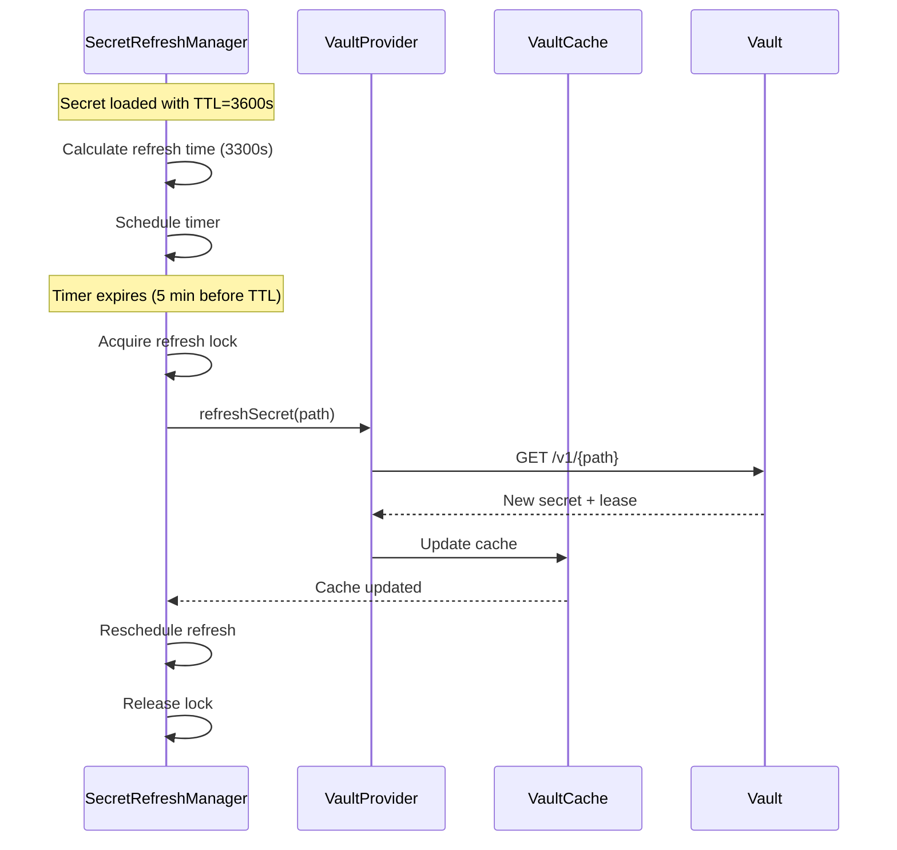

### Thread Safety Considerations

**Problem**: Multiple refresh attempts for the same secret can cause:
- Token invalidation
- Race conditions
- Unnecessary API calls

**Solution**: Refresh Lock (Mutex pattern)

```typescript
class RefreshLock {
  private locks: Map<string, Promise<void>> = new Map();
  
  async execute<T>(key: string, operation: () => Promise<T>): Promise<T> {
    // Wait for existing lock
    const existingLock = this.locks.get(key);
    if (existingLock) {
      await existingLock;
    }
    
    // Create new lock
    const lockPromise = operation()
      .finally(() => {
        this.locks.delete(key);
      });
    
    this.locks.set(key, lockPromise.then(() => {}));
    return lockPromise;
  }
}
```

### Refresh Failure Handling

**Failure Scenarios**:

1. **Network Error**: Retry with exponential backoff
2. **Authentication Error**: Re-authenticate, then retry
3. **Secret Not Found**: Log error, invalidate cache
4. **Rate Limited**: Wait for rate limit window, retry

**Fallback Strategy**:
```typescript
interface RefreshFailureStrategy {
  maxRetries: number;           // Default: 3
  retryBackoff: RetryBackoff;
  onFinalFailure: 'fail' | 'use_stale' | 'shutdown';
  
  // Use stale secret if:
  // - Refresh failed
  // - Cache age < maxStaleAge
  // - onFinalFailure === 'use_stale'
  maxStaleAge: number;          // Default: TTL * 0.5
}
```

### Clock Skew Handling

**Problem**: System clock differences can cause premature expiration.

**Solution**:
- Use Vault's `lease_duration` (server-side TTL)
- Add clock skew buffer: 60 seconds
- Refresh earlier if clock skew detected

---

## ConfigService Integration Design

### Initialization Flow

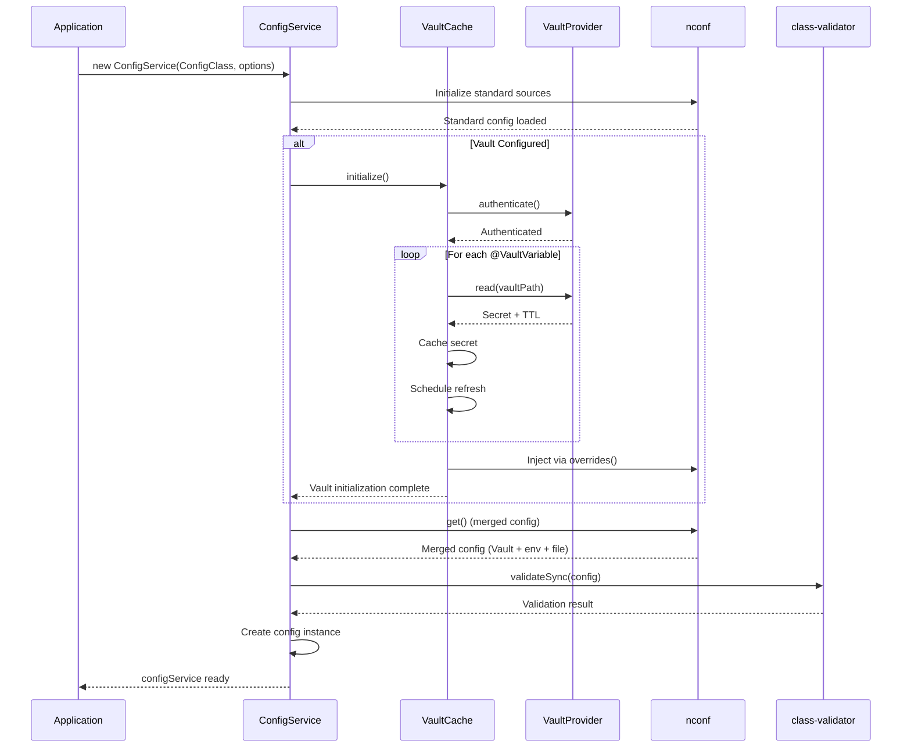

### Property-to-Vault Mapping

**How ConfigService knows which properties come from Vault**:

1. **Decorator Metadata**: `@ConfigVariable` stores vault config in metadata
2. **Reflection**: Scan config class properties for vault metadata
3. **Mapping**: Create property name → Vault path mapping

**Implementation**:
```typescript
class VaultMetadataScanner {
  scanConfigClass(configClass: TClass<BaseConfig>): Map<string, IVaultConfigOptions> {
    const vaultProperties = new Map<string, IVaultConfigOptions>();
    
    // Use reflect-metadata or class-transformer to get decorator metadata
    const properties = this.getPropertiesWithMetadata(configClass);
    
    for (const [propertyName, metadata] of properties) {
      if (metadata.vault) {
        vaultProperties.set(propertyName, metadata.vault);
      }
    }
    
    return vaultProperties;
  }
}
```

### Cache Structure

**VaultCache Design**:

```typescript
interface VaultCacheEntry {
  secret: VaultSecret;
  cachedAt: number;
  expiresAt: number;
  refreshScheduled: boolean;
  propertyName: string;        // Config property name
  vaultPath: string;            // Vault path
}

class VaultCache {
  private cache: Map<string, VaultCacheEntry> = new Map();
  private propertyToPath: Map<string, string> = new Map();
  private pathToProperty: Map<string, string> = new Map();
  
  // Key: property name (e.g., 'DATABASE_PASSWORD')
  // Value: VaultCacheEntry
}
```

### Cache Invalidation

**Invalidation Triggers**:

1. **TTL Expiration**: Automatic on access
2. **Manual**: `configService.invalidateVaultCache(path)`
3. **Refresh Failure**: Invalidate on persistent failures
4. **Secret Rotation**: Invalidate when secret rotated in Vault

**Invalidation Flow**:
```typescript
invalidate(path: string): void {
  const entry = this.cache.get(path);
  if (entry) {
    // Cancel scheduled refresh
    this.refreshManager.cancelRefresh(path);
    
    // Remove from cache
    this.cache.delete(path);
    
    // Remove from nconf overrides
    const propertyName = this.pathToProperty.get(path);
    if (propertyName) {
      nconf.remove(propertyName);
    }
  }
}
```

### Synchronous Access Pattern

**Challenge**: Vault is async, but `configService.config.*` must be synchronous.

**Solution**: Pre-load all Vault secrets during async initialization, then access synchronously.

```typescript
// During initialization (async)
await configService.initializeVault();

// At runtime (synchronous)
const password = configService.config.DATABASE_PASSWORD; // From cache
```

**Edge Case**: Cache miss during runtime (shouldn't happen, but handle gracefully)

```typescript
get config(): T {
  // If Vault cache miss, fallback to nconf (env/file)
  // This should only happen if:
  // 1. Vault initialization failed and fallback enabled
  // 2. Cache was invalidated and refresh pending
  return this.cachedConfigInstance;
}
```

---

## Component Diagrams

### High-Level Architecture

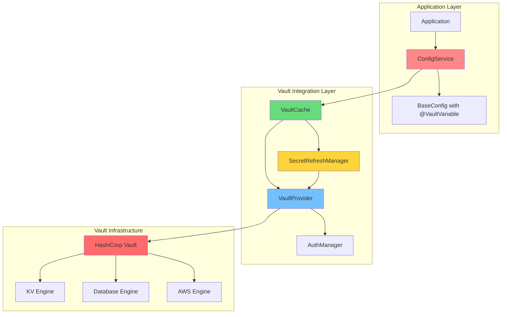

### Detailed Component Interactions

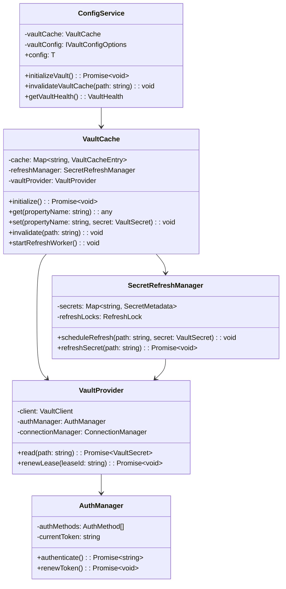

---

## Sequence Diagrams

### Initialization Sequence

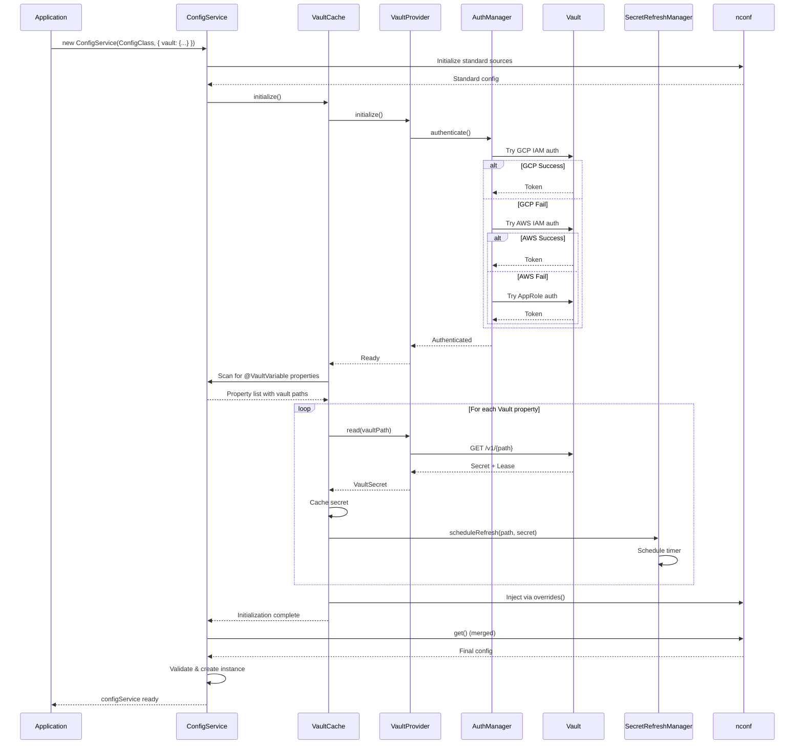

### Secret Refresh Sequence

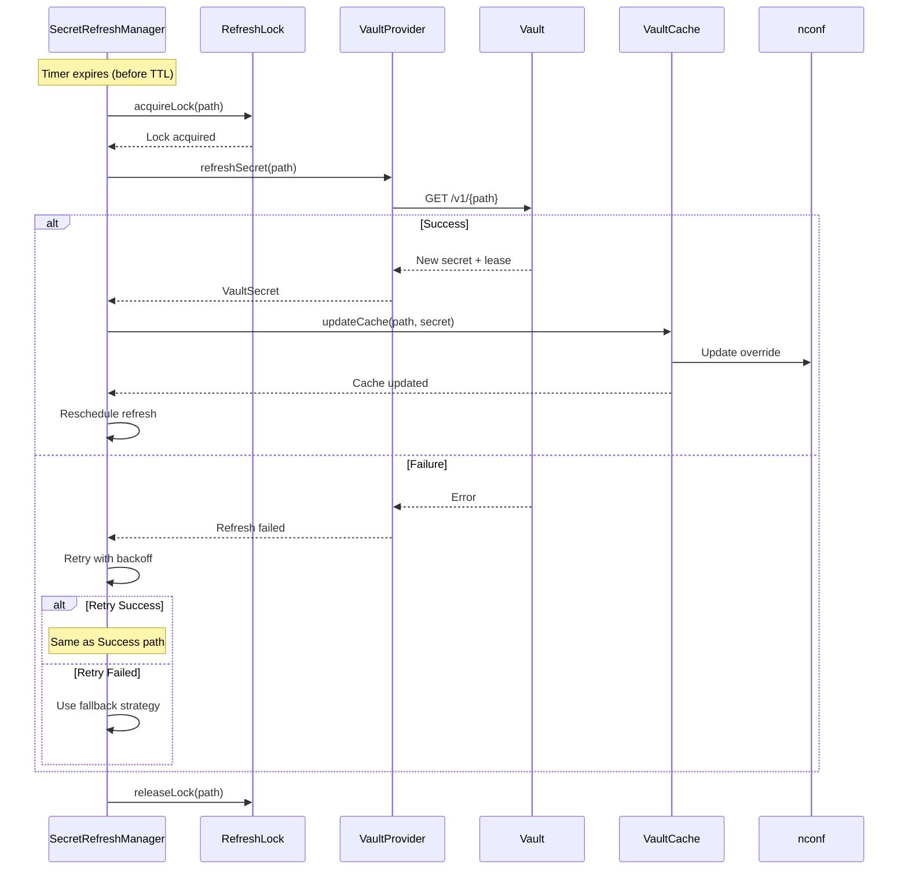

### Synchronous Access Sequence

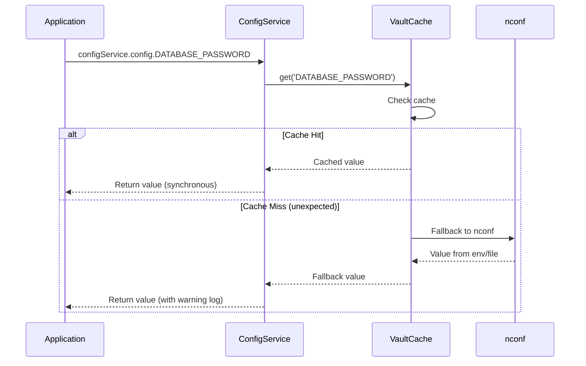

---

## Interface Definitions

### Core Interfaces

```typescript
/**
 * Vault configuration options
 */
interface IVaultConfigOptions {
  /**
   * Vault server endpoint (must be HTTPS)
   */
  endpoint: string;
  
  /**
   * Authentication configuration
   */
  auth: IVaultAuthConfig;
  
  /**
   * TLS configuration
   */
  tls?: IVaultTLSConfig;
  
  /**
   * Refresh buffer (seconds) - default: min(10% of TTL, 300s)
   */
  refreshBuffer?: number;
  
  /**
   * Fallback configuration
   */
  fallback?: IVaultFallbackConfig;
  
  /**
   * Retry configuration
   */
  retry?: IRetryPolicy;
  
  /**
   * Circuit breaker configuration
   */
  circuitBreaker?: ICircuitBreakerConfig;
}

/**
 * Authentication configuration with priority
 */
interface IVaultAuthConfig {
  /**
   * Authentication methods in priority order
   * Tried sequentially until one succeeds
   */
  methods: IVaultAuthMethod[];
}

/**
 * Individual authentication method
 */
interface IVaultAuthMethod {
  type: 'gcp' | 'aws' | 'approle' | 'token';
  config: IGCPAuthConfig | IAWSAuthConfig | IAppRoleAuthConfig | ITokenAuthConfig;
}

/**
 * GCP IAM authentication
 */
interface IGCPAuthConfig {
  type: 'gcp';
  role: string;
  serviceAccountEmail?: string;  // Default: from metadata server
  jwtExpiration?: number;         // Default: 15 minutes
}

/**
 * AWS IAM authentication
 */
interface IAWSAuthConfig {
  type: 'aws';
  role: string;
  // Uses instance profile or environment credentials
}

/**
 * AppRole authentication
 */
interface IAppRoleAuthConfig {
  type: 'approle';
  roleId: string;                 // Can be in config
  secretId: string;               // MUST come from secure source
  mountPath?: string;             // Default: 'approle'
}

/**
 * Token authentication (dev only)
 */
interface ITokenAuthConfig {
  type: 'token';
  token: string;                  // MUST come from secure source
}

/**
 * TLS configuration
 */
interface IVaultTLSConfig {
  /**
   * Require TLS (default: true, cannot be disabled)
   */
  enabled: boolean;                // Default: true
  
  /**
   * Verify server certificate (default: true)
   */
  verifyCertificate: boolean;      // Default: true
  
  /**
   * Certificate fingerprint for pinning (optional)
   */
  certificateFingerprint?: string;
  
  /**
   * Custom CA certificate (optional)
   */
  caCert?: string | Buffer;
  
  /**
   * Minimum TLS version
   */
  minVersion?: 'TLSv1.2' | 'TLSv1.3';  // Default: 'TLSv1.2'
}

/**
 * Fallback configuration
 */
interface IVaultFallbackConfig {
  /**
   * Whether Vault is required (default: true)
   * If false, falls back to env/file on initialization failure
   */
  required: boolean;                // Default: true
  
  /**
   * Use cached secrets on failure (default: true)
   */
  useCacheOnFailure: boolean;      // Default: true
  
  /**
   * Maximum cache age for fallback (ms)
   */
  maxCacheAge: number;              // Default: TTL or 1 hour
  
  /**
   * Fail fast on refresh failure (default: true for required secrets)
   */
  failFast: boolean;                // Default: true
}

/**
 * Retry policy
 */
interface IRetryPolicy {
  maxAttempts: number;              // Default: 3
  backoff: {
    strategy: 'exponential' | 'linear' | 'fixed';
    initial: number;                // Default: 1000ms
    max: number;                    // Default: 10000ms
    multiplier: number;              // Default: 2
  };
  retryableErrors: string[];        // Default: ['ECONNREFUSED', 'ETIMEDOUT', '5xx']
}

/**
 * Circuit breaker configuration
 */
interface ICircuitBreakerConfig {
  enabled: boolean;                // Default: true
  failureThreshold: number;         // Default: 5
  resetTimeout: number;             // Default: 60000ms
  halfOpenMaxRequests: number;     // Default: 1
}

/**
 * Vault secret response
 */
interface VaultSecret {
  /**
   * Secret data (engine-specific structure)
   */
  data: Record<string, any>;
  
  /**
   * Lease ID (for dynamic secrets)
   */
  leaseId?: string;
  
  /**
   * Lease duration in seconds
   */
  leaseDuration: number;
  
  /**
   * Whether lease is renewable
   */
  renewable: boolean;
  
  /**
   * Metadata (for KV v2)
   */
  metadata?: {
    createdTime: string;
    deletionTime: string;
    destroyed: boolean;
    version: number;
  };
}

/**
 * Vault cache entry
 */
interface VaultCacheEntry {
  secret: VaultSecret;
  cachedAt: number;
  expiresAt: number;
  refreshScheduled: boolean;
  propertyName: string;
  vaultPath: string;
  refreshAt: number;
}

/**
 * Vault health status
 */
interface VaultHealth {
  connected: boolean;
  authenticated: boolean;
  cacheSize: number;
  refreshQueueSize: number;
  lastRefreshTime: number;
  errors: VaultError[];
}

/**
 * Vault error
 */
interface VaultError {
  timestamp: number;
  path: string;
  error: string;                    // Sanitized
  retryable: boolean;
}
```

### Decorator Extensions

```typescript
/**
 * Vault-specific options for @ConfigVariable
 */
interface IVaultVariableOptions {
  /**
   * Full Vault path (e.g., 'secret/data/myapp/db_password')
   */
  path: string;
  
  /**
   * Secrets engine type (auto-detected if not specified)
   */
  engine?: 'kv-v1' | 'kv-v2' | 'database' | 'aws' | 'gcp' | 'azure';
  
  /**
   * Key name for KV engines (defaults to property name)
   */
  key?: string;
  
  /**
   * Override default refresh buffer (seconds)
   */
  refreshBuffer?: number;
  
  /**
   * Whether to fail if Vault is unavailable (default: true)
   */
  required?: boolean;
  
  /**
   * Custom fallback value if Vault unavailable and required=false
   */
  fallbackValue?: any;
}

/**
 * Extended ConfigVariable options
 */
interface IConfigVariableOptions {
  exclude?: boolean;
  vault?: IVaultVariableOptions;
}
```

### Usage Example

```typescript
import { BaseConfig, Configuration, ConfigVariable } from '@kibibit/configit';
import { IsString, IsNumber } from 'class-validator';

@Configuration()
export class AppConfig extends BaseConfig {
  // From Vault KV v2
  @ConfigVariable('Database password', {
    vault: {
      path: 'secret/data/myapp/database',
      engine: 'kv-v2',
      key: 'password'
    }
  })
  @IsString()
  DATABASE_PASSWORD: string;
  
  // From Vault Database Engine (dynamic secret)
  @ConfigVariable('Database credentials', {
    vault: {
      path: 'database/creds/my-role',
      engine: 'database'
      // Entire response used, extracts username/password from data
    }
  })
  DATABASE_USERNAME: string;  // Extracted from secret.data.username
  
  // Standard config (from env/file)
  @ConfigVariable('Database host')
  @IsString()
  DATABASE_HOST: string;
  
  // From Vault with custom refresh buffer
  @ConfigVariable('API key', {
    vault: {
      path: 'secret/data/myapp/api',
      engine: 'kv-v2',
      key: 'key',
      refreshBuffer: 600  // Refresh 10 min before expiry
    }
  })
  @IsString()
  API_KEY: string;
}
```

---

## Error Handling Strategies

### Error Classification

**Retryable Errors**:
- Network errors: `ECONNREFUSED`, `ETIMEDOUT`, `ENOTFOUND`
- HTTP 5xx responses
- HTTP 429 (rate limiting)
- Temporary authentication failures

**Non-retryable Errors**:
- HTTP 4xx (except 429): `400`, `401`, `403`, `404`
- Invalid configuration
- Certificate validation failures

### Error Handling Flow

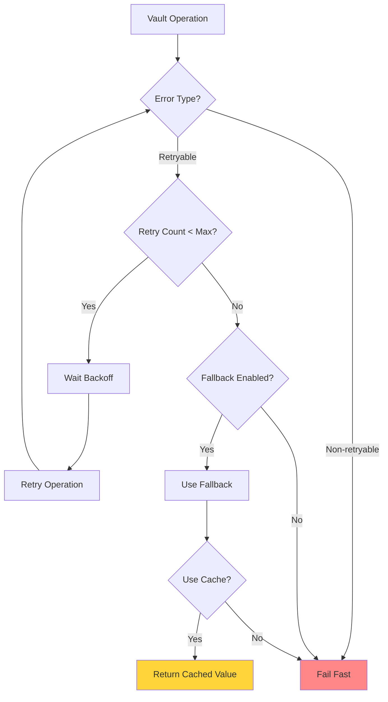

### Error Sanitization

**Critical Requirement**: Never expose secrets in error messages.

**Implementation**:
```typescript
class VaultErrorHandler {
  static sanitizeError(error: Error, context?: { path?: string }): string {
    let message = error.message;
    
    // Remove potential secret values
    message = SecretMasker.sanitizeError(message);
    
    // Remove sensitive path segments
    if (context?.path) {
      const sanitizedPath = this.sanitizePath(context.path);
      message = message.replace(context.path, sanitizedPath);
    }
    
    return message;
  }
  
  static sanitizePath(path: string): string {
    // Mask last segment if potentially sensitive
    const segments = path.split('/');
    if (segments.length > 0) {
      const lastSegment = segments[segments.length - 1];
      if (SecretMasker.mightContainSecret(lastSegment)) {
        segments[segments.length - 1] = '***';
      }
    }
    return segments.join('/');
  }
}
```

### Fallback Strategies

**Strategy 1: Fail Fast** (default for required secrets)
- Immediate failure on Vault unavailability
- Clear error message (sanitized)
- Application startup fails

**Strategy 2: Use Cache** (for optional secrets)
- Use cached value if available and within max age
- Log warning
- Continue operation

**Strategy 3: Graceful Shutdown** (for critical applications)
- Log critical error
- Initiate graceful shutdown
- Allow in-flight requests to complete

**Strategy 4: Use Stale** (not recommended, security risk)
- Use expired cache if within grace period
- Log security warning
- Continue with degraded security

---

## Configuration Schema

### ConfigService Options Extension

```typescript
export interface IConfigServiceOptions {
  // ... existing options ...
  
  /**
   * Vault integration configuration (optional)
   */
  vault?: IVaultConfigOptions;
}
```

### Complete Configuration Example

```typescript
const configService = new ConfigService(AppConfig, undefined, {
  fileFormat: EFileFormats.json,
  convertToCamelCase: false,
  
  vault: {
    endpoint: 'https://vault.example.com:8200',
    
    auth: {
      methods: [
        {
          type: 'gcp',
          config: {
            type: 'gcp',
            role: 'my-app-role',
            serviceAccountEmail: 'my-app@project.iam.gserviceaccount.com'
          }
        },
        {
          type: 'aws',
          config: {
            type: 'aws',
            role: 'my-app-role'
          }
        },
        {
          type: 'approle',
          config: {
            type: 'approle',
            roleId: process.env.VAULT_ROLE_ID,
            secretId: process.env.VAULT_SECRET_ID  // From secure source
          }
        }
      ]
    },
    
    tls: {
      enabled: true,
      verifyCertificate: true,
      minVersion: 'TLSv1.2'
    },
    
    refreshBuffer: 300,  // 5 minutes
    
    fallback: {
      required: true,
      useCacheOnFailure: true,
      maxCacheAge: 3600000,  // 1 hour
      failFast: true
    },
    
    retry: {
      maxAttempts: 3,
      backoff: {
        strategy: 'exponential',
        initial: 1000,
        max: 10000,
        multiplier: 2
      },
      retryableErrors: ['ECONNREFUSED', 'ETIMEDOUT', '5xx']
    },
    
    circuitBreaker: {
      enabled: true,
      failureThreshold: 5,
      resetTimeout: 60000,
      halfOpenMaxRequests: 1
    }
  }
});

// Initialize Vault (async)
await configService.initializeVault();

// Access config (synchronous)
const dbPassword = configService.config.DATABASE_PASSWORD;
```

### Environment Variable Configuration

For sensitive values (tokens, secret IDs), use environment variables:

```bash
# Vault authentication
export VAULT_ROLE_ID=your-role-id
export VAULT_SECRET_ID=your-secret-id  # From secure secret manager

# Or for token auth (dev only)
export VAULT_TOKEN=your-token
```

---

## Implementation Phases

### Phase 1: Core Vault Integration (MVP)

**Scope**:
- Basic Vault client integration
- KV v2 engine support
- Token authentication
- In-memory caching
- Background refresh
- Basic error handling

**Deliverables**:
- `VaultProvider` class
- `VaultCache` class
- `SecretRefreshManager` class
- `AuthManager` class (token only)
- ConfigService extensions
- Decorator extensions (`@ConfigVariable` with vault option)

**Success Criteria**:
- Can load secrets from Vault KV v2
- Secrets refresh before TTL expiry
- Synchronous API maintained
- Basic error handling
- Security: Secret masking in logs

**Estimated Timeline**: 2-3 weeks

### Phase 2: Multi-Auth & Multi-Engine Support

**Scope**:
- GCP IAM authentication
- AWS IAM authentication
- AppRole authentication
- Database secrets engine
- AWS secrets engine
- KV v1 support
- Enhanced error handling

**Deliverables**:
- GCP IAM auth implementation
- AWS IAM auth implementation
- AppRole auth implementation
- Engine-specific adapters
- Enhanced error handling

**Success Criteria**:
- All auth methods working
- All engines supported
- Robust error handling
- Security: All auth methods secure

**Estimated Timeline**: 2-3 weeks

### Phase 3: Advanced Features

**Scope**:
- Circuit breaker
- Health checks
- Metrics and monitoring
- Development mode (mock Vault)
- Enhanced refresh logic
- Secret rotation support

**Deliverables**:
- Circuit breaker implementation
- Health check API
- Metrics collection
- Mock Vault for testing
- Secret rotation handlers

**Success Criteria**:
- Production-ready resilience
- Comprehensive monitoring
- Easy testing
- Secret rotation handled gracefully

**Estimated Timeline**: 2-3 weeks

### Phase 4: Optimization & Polish

**Scope**:
- Performance optimization
- Documentation
- Examples
- Integration tests
- Security audit

**Deliverables**:
- Performance benchmarks
- Complete documentation
- Example applications
- Integration test suite
- Security audit report

**Success Criteria**:
- Performance targets met
- Documentation complete
- Examples working
- Tests passing
- Security audit passed

**Estimated Timeline**: 1-2 weeks

---

## Security Considerations

All security requirements from the security analysis must be implemented:

1. **Secret Masking**: ✅ All logging masks secrets
2. **Error Sanitization**: ✅ All errors sanitized
3. **TLS Enforcement**: ✅ TLS required, no HTTP
4. **Secure Authentication**: ✅ Secure auth methods only
5. **Token Security**: ✅ Tokens never logged, stored securely
6. **TTL Management**: ✅ Proper refresh logic
7. **Path Validation**: ✅ Paths validated before access

See `docs/vault-integration/analysis/security-analysis.md` for complete security requirements.

---

## Testing Strategy

### Unit Tests
- Mock Vault client
- Test caching logic
- Test refresh scheduling
- Test error handling
- Test secret masking

### Integration Tests
- Use Vault Dev Server
- Test real Vault operations
- Test authentication methods
- Test refresh logic
- Test fallback strategies

### E2E Tests
- Full application bootstrap
- Test with real Vault instance
- Test failure scenarios
- Test performance

---

## Monitoring & Observability

### Metrics to Track
- Vault API call count and latency
- Cache hit/miss rates
- Secret refresh success/failure rates
- Token renewal success/failure
- Error rates by type
- Circuit breaker state

### Logging
- Vault initialization events (sanitized)
- Secret refresh events (sanitized)
- Authentication events (sanitized)
- Error events (sanitized)
- Health check results

### Health Checks
```typescript
interface VaultHealth {
  connected: boolean;
  authenticated: boolean;
  cacheSize: number;
  refreshQueueSize: number;
  lastRefreshTime: number;
  errors: VaultError[];
}

configService.getVaultHealth(): VaultHealth;
```

---

## Conclusion

This architecture design provides a comprehensive blueprint for integrating HashiCorp Vault into Configit while maintaining backward compatibility and security best practices. The design addresses all requirements:

1. ✅ **Source Priority**: Vault → env → file
2. ✅ **Auth Priority**: GCP IAM → AWS IAM → AppRole → Token
3. ✅ **Synchronous API**: Maintained through background refresh
4. ✅ **TTL Management**: Proactive refresh with buffer
5. ✅ **Security**: All security requirements addressed
6. ✅ **Error Handling**: Comprehensive error handling and fallback strategies

**Next Steps**:
1. Review and approve architecture
2. Begin Phase 1 implementation
3. Set up Vault dev environment for testing
4. Implement security controls from security analysis

---

**Document Version**: 1.0  
**Last Updated**: 2024  
**Status**: Ready for Implementation Review
