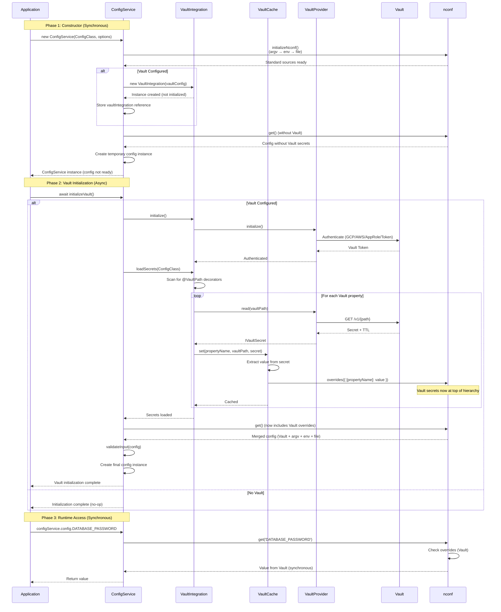

# ConfigService Vault Integration Design

**Author**: Systems Architecture Specialist  
**Date**: 2025-01-21  
**Status**: Integration Design  
**Context**: Integrating VaultIntegration into ConfigService with synchronous API requirement

---

## Executive Summary

This document provides the detailed integration design for connecting `VaultIntegration` into `ConfigService` while maintaining the synchronous `configService.config` API. The design ensures Vault secrets have the highest priority in the nconf hierarchy and are pre-loaded before config access.

**Key Requirements**:
1. **Source Hierarchy**: Vault → CLI args → Env vars → Config files (Vault highest priority)
2. **Synchronous API**: `ConfigService.config` must remain synchronous - Vault secrets pre-loaded
3. **nconf Integration**: Use `nconf.overrides()` to inject Vault secrets at top of hierarchy
4. **Initialization Flow**: Design when/how `initializeVault()` is called during construction
5. **Optional Vault**: Vault is optional - existing behavior unchanged if not configured

---

## Current State Analysis

### ConfigService Constructor Flow

```typescript
constructor(givenClass, passedConfig?, options?) {
  // 1. Initialize nconf hierarchy: argv → env → file
  this.initializeNconf();
  
  // 2. Get config from nconf (no Vault yet)
  const config = passedConfig || nconf.get();
  
  // 3. Validate and create config instance
  this.config = this.createConfigInstance(genericClass, envConfig);
}
```

**Current nconf Hierarchy**:
```
argv (CLI arguments)
  ↓
env (Environment Variables)
  ↓
file (Config Files)
```

### VaultIntegration Current State

- `VaultCache.set()` already calls `nconf.overrides({ [propertyName]: value })` (line 83)
- `initializeVault()` exists but is called separately (async)
- Secrets are loaded AFTER config creation, requiring re-validation

### Problem Statement

**Challenge**: Vault initialization is async, but `ConfigService.config` must be synchronous.

**Current Flow**:
1. Constructor runs (sync)
2. Config created from nconf (no Vault secrets)
3. `initializeVault()` called separately (async)
4. Secrets loaded and injected into nconf
5. Config re-created with Vault secrets

**Issue**: Config is created before Vault secrets are available, requiring re-creation.

---

## Integration Design

### Target Source Hierarchy

```
Vault (nconf.overrides) ← HIGHEST PRIORITY
  ↓
argv (CLI arguments)
  ↓
env (Environment Variables)
  ↓
file (Config Files)
```

### Solution: Two-Phase Initialization Pattern

Since constructors cannot be async, we use a **two-phase initialization pattern**:

1. **Phase 1 (Constructor)**: Set up nconf, prepare for Vault
2. **Phase 2 (Async Init)**: Load Vault secrets, inject into nconf, create final config

**Key Insight**: `VaultCache.set()` already injects into nconf via `overrides()`. We need to ensure this happens BEFORE the final config is created.

### Initialization Sequence

```
┌─────────────────────────────────────────────────────────────┐
│ Phase 1: Constructor (Synchronous)                          │
├─────────────────────────────────────────────────────────────┤
│ 1. Initialize nconf hierarchy (argv → env → file)          │
│ 2. Check if Vault configured                                │
│ 3. If Vault: Create VaultIntegration instance               │
│ 4. Create temporary config (for validation only)            │
│ 5. Return ConfigService instance                            │
└─────────────────────────────────────────────────────────────┘
                          ↓
┌─────────────────────────────────────────────────────────────┐
│ Phase 2: Vault Initialization (Async)                      │
├─────────────────────────────────────────────────────────────┤
│ 1. Call initializeVault() (if Vault configured)             │
│ 2. VaultIntegration.initialize() - authenticate             │
│ 3. VaultIntegration.loadSecrets() - load secrets           │
│ 4. VaultCache.set() - injects into nconf.overrides()       │
│ 5. Re-validate config with Vault secrets                    │
│ 6. Create final config instance                             │
└─────────────────────────────────────────────────────────────┘
                          ↓
┌─────────────────────────────────────────────────────────────┐
│ Phase 3: Runtime Access (Synchronous)                       │
├─────────────────────────────────────────────────────────────┤
│ configService.config.DATABASE_PASSWORD                      │
│   → nconf.get() includes Vault overrides                   │
│   → Returns value synchronously from cache                 │
└─────────────────────────────────────────────────────────────┘
```

### Detailed Sequence Diagram



---

## Code Changes Required

### 1. ConfigService Constructor Modifications

**Current** (lines 90-163):
```typescript
constructor(givenClass, passedConfig?, options = {}) {
  // ... setup ...
  this.initializeNconf();
  const config = passedConfig || nconf.get();
  // ... create config ...
}
```

**Proposed**:
```typescript
constructor(givenClass, passedConfig?, options = {}) {
  // ... existing setup ...
  
  this.initializeNconf();
  
  // Create VaultIntegration instance if configured (not initialized yet)
  if (this.options.vault) {
    this.vaultIntegration = new VaultIntegration(this.options.vault);
    // Note: Not initialized yet - will be done in initializeVault()
  }
  
  // Get initial config (without Vault secrets)
  const config = passedConfig || nconf.get();
  
  // Handle early exit cases (init, validate, etc.)
  // ... existing early exit logic ...
  
  // Create initial config instance (will be re-created after Vault init)
  const envConfig = this.validateInput(config);
  if (envConfig) {
    envConfig.NODE_ENV = this.mode;
    this.config = this.createConfigInstance(this.genericClass, envConfig as T) as T;
  }
  
  configService = this;
}
```

### 2. initializeVault() Method Enhancement

**Current** (lines 169-198):
```typescript
async initializeVault(): Promise<void> {
  if (!this.options.vault) return;
  
  this.vaultIntegration = new VaultIntegration(this.options.vault);
  await this.vaultIntegration.initialize();
  await this.vaultIntegration.loadSecrets(this.genericClass);
  
  // Re-validate and re-create config
  const config = nconf.get();
  const envConfig = this.validateInput(config);
  if (envConfig) {
    envConfig.NODE_ENV = this.mode;
    (this as { config?: T }).config = this.createConfigInstance(...);
  }
}
```

**Proposed** (enhanced):
```typescript
async initializeVault(): Promise<void> {
  if (!this.options.vault) {
    return; // Vault not configured - no-op
  }

  if (!this.vaultIntegration) {
    // Should not happen if constructor ran correctly
    throw new Error('VaultIntegration not created. Check constructor.');
  }

  if (!this.genericClass) {
    throw new Error('ConfigService not properly initialized');
  }

  try {
    // Initialize Vault connection and authenticate
    await this.vaultIntegration.initialize();

    // Load secrets for this config class
    // This will call VaultCache.set() which injects into nconf.overrides()
    await this.vaultIntegration.loadSecrets(this.genericClass as unknown as new () => T);

    // Now that Vault secrets are in nconf.overrides(), re-validate config
    const config = nconf.get(); // Now includes Vault secrets (highest priority)
    const envConfig = this.validateInput(config);
    
    if (envConfig) {
      envConfig.NODE_ENV = this.mode;
      // Update config instance with Vault secrets included
      (this as { config?: T }).config = this.createConfigInstance(
        this.genericClass,
        envConfig as T
      ) as T;
    }
  } catch (error) {
    // Handle initialization failure based on fallback config
    const fallback = this.options.vault.fallback;
    
    if (fallback?.required !== false) {
      // Required - rethrow error
      throw new Error(
        `Vault initialization failed: ${error.message}. ` +
        `Vault is required for this configuration.`
      );
    }
    
    // Optional - log warning and continue with existing config
    console.warn(
      `Vault initialization failed: ${error.message}. ` +
      `Continuing without Vault secrets.`
    );
    // Config already created without Vault secrets - that's fine
  }
}
```

### 3. Decorator-to-nconf Connection

**How decorators connect to nconf overrides**:

1. **Decorator Application**:
   ```typescript
   @VaultPath('secret/data/myapp/database')
   @VaultKey('password')
   DATABASE_PASSWORD: string;
   ```

2. **Metadata Discovery** (in `VaultIntegration.loadSecrets()`):
   ```typescript
   const vaultMetadata = getAllVaultMetadata(targetClass);
   // Returns: { DATABASE_PASSWORD: { path, engine, key, ... } }
   ```

3. **Secret Loading** (in `VaultIntegration.loadSecrets()`):
   ```typescript
   const secret = await this.provider.read(fullPath);
   // secret.data = { password: 'secret-value' }
   ```

4. **Cache Injection** (in `VaultCache.set()`):
   ```typescript
   const value = this.extractValue(secret, metadata);
   // value = 'secret-value' (extracted using metadata.key)
   
   nconf.overrides({ [propertyName]: value });
   // nconf.overrides({ DATABASE_PASSWORD: 'secret-value' })
   ```

5. **Config Access**:
   ```typescript
   nconf.get('DATABASE_PASSWORD')
   // Checks: overrides → argv → env → file
   // Returns: 'secret-value' from Vault (highest priority)
   ```

**Flow Diagram**:
```
@VaultPath decorator
  ↓
getAllVaultMetadata() scans class
  ↓
VaultIntegration.loadSecrets() loads from Vault
  ↓
VaultCache.set() extracts value
  ↓
nconf.overrides({ propertyName: value })
  ↓
nconf.get() returns Vault value (highest priority)
```

---

## Error Handling Strategy

### 1. Vault Unavailable During Initialization

**Scenario**: Vault server is down or unreachable during `initializeVault()`.

**Strategy**:
- **If `fallback.required === false`**: Log warning, continue without Vault secrets
- **If `fallback.required === true` (default)**: Throw error, fail fast

**Implementation**:
```typescript
try {
  await this.vaultIntegration.initialize();
} catch (error) {
  if (this.options.vault.fallback?.required === false) {
    console.warn(`Vault unavailable: ${error.message}. Continuing without Vault.`);
    return; // Continue with config without Vault secrets
  }
  throw error; // Fail fast
}
```

### 2. Secret Missing from Vault

**Scenario**: Vault is available, but a required secret path doesn't exist.

**Strategy**:
- **If `@VaultOptional()` decorator**: Log warning, fallback to env/file
- **If required (default)**: Throw error with sanitized message

**Implementation** (in `VaultIntegration.loadSecrets()`):
```typescript
try {
  const secret = await this.provider.read(fullPath);
  // ... cache secret ...
} catch (error) {
  const property = properties[0]; // Get property metadata
  if (!property.required) {
    // Optional secret - log and continue
    console.warn(`Optional secret not found: ${sanitizePath(fullPath)}`);
    return;
  }
  // Required secret - throw error
  throw new Error(`Required secret not found: ${sanitizePath(fullPath)}`);
}
```

### 3. Vault Authentication Failure

**Scenario**: All authentication methods fail.

**Strategy**: Fail fast with clear error message.

**Implementation**:
```typescript
try {
  await this.provider.initialize(); // Tries all auth methods
} catch (error) {
  throw new Error(
    `Vault authentication failed: ${error.message}. ` +
    `Tried: GCP IAM, AWS IAM, AppRole, Token`
  );
}
```

### 4. Cache Miss During Runtime (Shouldn't Happen)

**Scenario**: Config accessed before `initializeVault()` completes.

**Strategy**: 
- **If Vault configured but not initialized**: Throw error with clear message
- **If Vault not configured**: Use standard nconf hierarchy

**Implementation**:
```typescript
get config(): T {
  // If Vault is configured but not initialized, throw error
  if (this.options.vault && !this.vaultIntegration?.isInitialized()) {
    throw new Error(
      'Vault is configured but not initialized. ' +
      'Call await configService.initializeVault() before accessing config.'
    );
  }
  
  // Config already includes Vault secrets via nconf.overrides()
  return this.config;
}
```

**Note**: This is a guard - in practice, users should call `initializeVault()` before accessing config.

---

## Usage Pattern

### Standard Usage (With Vault)

```typescript
import { ConfigService } from '@kibibit/configit';
import { AppConfig } from './config.model';

// Phase 1: Create ConfigService (synchronous)
const configService = new ConfigService(AppConfig, undefined, {
  vault: {
    endpoint: 'https://vault.example.com:8200',
    auth: {
      methods: [
        {
          type: 'gcp',
          config: { role: 'my-app-role' }
        }
      ]
    },
    fallback: {
      required: true // Fail if Vault unavailable
    }
  }
});

// Phase 2: Initialize Vault (async)
await configService.initializeVault();

// Phase 3: Access config (synchronous)
const dbPassword = configService.config.DATABASE_PASSWORD; // From Vault
const dbHost = configService.config.DATABASE_HOST; // From env/file
```

### Usage Without Vault (Backward Compatible)

```typescript
// No vault option - works exactly as before
const configService = new ConfigService(AppConfig);

// No initializeVault() call needed
const dbHost = configService.config.DATABASE_HOST; // From env/file
```

### Error Handling Example

```typescript
try {
  await configService.initializeVault();
} catch (error) {
  console.error('Failed to initialize Vault:', error.message);
  process.exit(1);
}

// Check Vault health
const health = configService.getVaultHealth();
if (!health?.connected) {
  console.warn('Vault connection lost, using cached secrets');
}
```

---

## Implementation Checklist

### ConfigService Changes

- [ ] Modify constructor to create `VaultIntegration` instance if configured
- [ ] Keep initial config creation (will be updated after Vault init)
- [ ] Enhance `initializeVault()` with proper error handling
- [ ] Add guard in config getter to ensure Vault initialized if configured
- [ ] Update JSDoc comments

### VaultIntegration Changes

- [ ] Ensure `loadSecrets()` properly calls `VaultCache.set()`
- [ ] Verify `VaultCache.set()` calls `nconf.overrides()`
- [ ] Add error handling for missing secrets
- [ ] Add support for optional secrets (`@VaultOptional`)

### Testing

- [ ] Test initialization flow with Vault configured
- [ ] Test initialization flow without Vault (backward compatibility)
- [ ] Test error handling (Vault unavailable, secrets missing)
- [ ] Test source hierarchy (Vault overrides argv/env/file)
- [ ] Test optional secrets fallback

---

## Architecture Decisions

### Decision 1: Two-Phase Initialization

**Rationale**: 
- Constructors cannot be async in TypeScript
- Maintains synchronous `config` API
- Clear separation of concerns

**Alternatives Considered**:
- **Async constructor**: Not possible in TypeScript
- **Factory pattern**: More complex API, breaks existing usage
- **Lazy initialization**: Complex, potential race conditions

**Chosen**: Two-phase initialization (constructor + `initializeVault()`)

### Decision 2: nconf.overrides() for Vault Secrets

**Rationale**:
- `overrides()` provides highest priority in nconf hierarchy
- Already implemented in `VaultCache.set()`
- No changes needed to nconf setup

**Alternatives Considered**:
- **Custom nconf source**: Would require async support
- **Pre-merge before nconf**: More complex, loses nconf benefits

**Chosen**: Use `nconf.overrides()` (already implemented)

**Implementation Note**: 
The current `VaultCache.set()` implementation calls `nconf.overrides({ [propertyName]: value })` for each secret individually. If `nconf.overrides()` replaces the entire overrides object (typical behavior), this could cause secrets to overwrite each other. **This should be verified and fixed if needed** by merging existing overrides:

```typescript
// Current (potentially buggy):
nconf.overrides({ [propertyName]: value });

// Should be (if nconf.overrides() replaces):
const existing = nconf.get('overrides') || {};
nconf.overrides({ ...existing, [propertyName]: value });
```

However, if nconf internally merges overrides, the current implementation is correct.

### Decision 3: Re-create Config After Vault Init

**Rationale**:
- Ensures config includes Vault secrets
- Validates final merged configuration
- Maintains type safety

**Alternatives Considered**:
- **Update config properties directly**: Bypasses validation
- **Lazy property access**: Complex, potential issues

**Chosen**: Re-create config instance after Vault secrets loaded

---

## Security Considerations

1. **Secret Masking**: All errors sanitized (already implemented)
2. **TLS Required**: Vault endpoint must be HTTPS (enforced in VaultProvider)
3. **Token Security**: Tokens never logged or exposed
4. **Path Validation**: Vault paths validated before access
5. **Error Sanitization**: Paths and errors sanitized in logs

---

## Performance Considerations

1. **Pre-loading**: All secrets loaded during initialization (not on-demand)
2. **Caching**: Secrets cached in memory for fast access
3. **Background Refresh**: Secrets refreshed before TTL expiry
4. **Synchronous Access**: No async overhead during runtime

---

## Migration Guide

### For Existing Users (No Vault)

**No changes required** - existing code works unchanged:
```typescript
const configService = new ConfigService(AppConfig);
const value = configService.config.SOME_VALUE; // Works as before
```

### For New Users (With Vault)

**Add Vault configuration and initialization**:
```typescript
const configService = new ConfigService(AppConfig, undefined, {
  vault: { /* vault config */ }
});

await configService.initializeVault(); // NEW: Required if using Vault

const value = configService.config.SOME_VALUE; // Works as before
```

---

## Conclusion

This design provides a clean integration of VaultIntegration into ConfigService while:

1. ✅ Maintaining synchronous `config` API
2. ✅ Ensuring Vault secrets have highest priority
3. ✅ Using `nconf.overrides()` for integration
4. ✅ Supporting optional Vault (backward compatible)
5. ✅ Providing clear error handling

The two-phase initialization pattern is a pragmatic solution to the async constructor limitation, and the existing `VaultCache.set()` implementation already handles nconf integration correctly.

---

**Document Version**: 1.0  
**Last Updated**: 2025-01-21  
**Status**: Ready for Implementation
