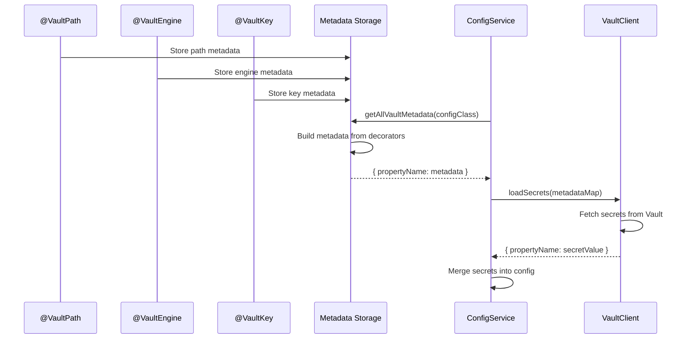

# Decorator API Design for Vault Secrets Integration

**Author**: Systems Architecture Specialist  
**Date**: 2024  
**Status**: Design Phase  
**Context**: Design decorator API for mapping Configit configuration properties to HashiCorp Vault secrets

---

## Executive Summary

This document designs the decorator API for integrating HashiCorp Vault secrets into Configit's configuration system. The design uses **composable decorators** that work alongside `@ConfigVariable` and `class-validator` decorators, following the same pattern as `class-validator` for consistency and flexibility.

**Key Design Decisions**:
1. **Composable decorators** - Each decorator does ONE thing (separation of concerns)
2. **Follows `class-validator` pattern** - Familiar API for developers
3. **Explicit path mapping** - Security-first, explicit is better than implicit
4. **Per-property configuration** - Flexible, supports multiple engines per config class
5. **Order-independent** - Decorators can be applied in any order

---

## Table of Contents

1. [Design Goals](#design-goals)
2. [API Design Options](#api-design-options)
3. [Selected Design: Composable Decorators](#selected-design-composable-decorators)
4. [TypeScript Interface Definitions](#typescript-interface-definitions)
5. [Metadata Storage Design](#metadata-storage-design)
6. [Usage Patterns](#usage-patterns)
7. [Migration Guide](#migration-guide)
8. [Edge Cases and Error Handling](#edge-cases-and-error-handling)
9. [Implementation Considerations](#implementation-considerations)

---

## Design Goals

### Primary Goals

1. **Backward Compatibility**: Existing decorators must continue to work without Vault
2. **Explicit Configuration**: Vault paths must be explicitly declared (security best practice)
3. **Type Safety**: Full TypeScript type checking and IntelliSense support
4. **Flexibility**: Support multiple Vault engines, paths, and refresh strategies per config class
5. **Simplicity**: Easy to use for common cases, powerful for advanced scenarios

### Secondary Goals

1. **Developer Experience**: Clear error messages, helpful documentation
2. **Performance**: Minimal overhead when Vault is not used
3. **Testability**: Easy to mock and test Vault integration
4. **Observability**: Support for logging and monitoring

---

## API Design Options

### Option A: Composable Decorators (SELECTED)

**Approach**: Create dedicated decorators that compose with `@ConfigVariable` and `class-validator` decorators

**Pros**:
- ✅ Separation of concerns (each decorator does ONE thing)
- ✅ Follows `class-validator` pattern (familiar to developers)
- ✅ Composable and flexible
- ✅ Order-independent (can be applied in any order)
- ✅ Clear intent (each decorator is self-documenting)
- ✅ Easy to extend (add new decorators without breaking changes)

**Cons**:
- ⚠️ Multiple decorators per property (more verbose)
- ⚠️ Requires understanding decorator composition

**Example**:
```typescript
@VaultPath('database/creds/my-role')
@VaultEngine('database')
@VaultKey('password')
@ConfigVariable('Database password')
@IsString()
DATABASE_PASSWORD: string;
```

### Option B: Extend `@ConfigVariable`

**Approach**: Add optional `vault` property to `IConfigVariableOptions`

**Pros**:
- ✅ Maintains single decorator pattern
- ✅ Backward compatible (vault is optional)
- ✅ Less verbose

**Cons**:
- ❌ Mixes concerns (validation + Vault config)
- ❌ Less flexible (harder to extend)
- ❌ Doesn't follow `class-validator` pattern

**Example**:
```typescript
@ConfigVariable('Database password', {
  vault: {
    path: 'database/creds/my-role',
    engine: 'database',
    key: 'password'
  }
})
@IsString()
DATABASE_PASSWORD: string;
```

### Option C: Convention-Based Mapping

**Approach**: Auto-map properties to Vault paths based on naming convention

**Pros**:
- ✅ Minimal code changes
- ✅ Less verbose

**Cons**:
- ❌ Magic behavior (hard to debug)
- ❌ Less flexible (can't support multiple engines easily)
- ❌ Security concern (implicit paths)
- ❌ Harder to support dynamic secrets

**Example**:
```typescript
// Convention: vault:secret/data/{app}/{property_name}
@ConfigVariable('Database password')
@IsString()
DATABASE_PASSWORD: string; // Auto-maps to vault:secret/data/myapp/database_password
```

### Decision: Option A (Composable Decorators)

**Rationale**:
- Follows established patterns (`class-validator` style)
- Separation of concerns (each decorator has single responsibility)
- Composable and extensible
- Order-independent (better developer experience)
- Clear and explicit (security-first)

---

## Selected Design: Composable Decorators

### Core Decorator API

The design uses dedicated composable decorators that work alongside `@ConfigVariable` and `class-validator` decorators:

```typescript
/**
 * Specifies the Vault path for a property (required for Vault secrets)
 * @param path Full Vault path (e.g., 'secret/data/myapp/db_password' or 'database/creds/my-role')
 */
function VaultPath(path: string): PropertyDecorator;

/**
 * Specifies the Vault secrets engine type (optional, auto-detected from path)
 * @param engine Engine type
 */
function VaultEngine(engine: VaultEngineType): PropertyDecorator;

/**
 * Specifies the key name within the secret (optional, defaults to property name in kebab-case)
 * Only used for KV v1/v2 engines
 * @param key Key name
 */
function VaultKey(key: string): PropertyDecorator;

/**
 * Override default refresh buffer (optional)
 * @param seconds Refresh buffer in seconds (default: 300s or 10% of TTL, whichever is smaller)
 */
function VaultRefreshBuffer(seconds: number): PropertyDecorator;

/**
 * Mark secret as optional - fallback to environment variable if Vault unavailable
 * Without this decorator, Vault secrets are required by default
 */
function VaultOptional(): PropertyDecorator;
```

### Vault Engine Types

```typescript
type VaultEngineType =
  | 'kv-v1'        // Key-Value v1 (simple)
  | 'kv-v2'        // Key-Value v2 (versioned, default)
  | 'database'     // Database secrets engine (dynamic credentials)
  | 'aws'          // AWS secrets engine
  | 'azure'        // Azure secrets engine
  | 'gcp'          // GCP secrets engine
  | 'transit'      // Transit secrets engine (encryption)
  | 'pki'          // PKI secrets engine
  | 'custom';      // Custom engine (requires custom extraction logic)
```

### Decorator Composition Rules

1. **`@VaultPath` is required** - Any property with `@VaultPath` is treated as a Vault secret
2. **Order doesn't matter** - Decorators can be applied in any order
3. **Composition with `@ConfigVariable`** - Vault decorators work alongside `@ConfigVariable`
4. **Composition with `class-validator`** - Vault decorators work alongside validation decorators

### Example Usage

```typescript
// Simple KV secret
@VaultPath('secret/data/myapp/api')
@VaultKey('api_key')
@ConfigVariable('API Key')
@IsString()
API_KEY: string;

// Dynamic database credentials
@VaultPath('database/creds/my-role')
@VaultEngine('database')
@VaultKey('password')
@ConfigVariable('Database password')
@IsString()
DATABASE_PASSWORD: string;

// Optional Vault secret with fallback
@VaultPath('secret/data/myapp/optional')
@VaultOptional()
@ConfigVariable('Optional feature flag')
@IsOptional()
@IsBoolean()
FEATURE_FLAG?: boolean;

// Non-Vault property (unchanged)
@ConfigVariable('Server port')
@IsNumber()
PORT: number;
```

---

## TypeScript Interface Definitions

### Core Interfaces

```typescript
/**
 * Vault secret response structure
 */
interface VaultSecretResponse {
  /**
   * Secret data (structure varies by engine)
   */
  data: Record<string, any>;
  
  /**
   * Lease ID (for dynamic secrets)
   */
  lease_id?: string;
  
  /**
   * Lease duration in seconds (for dynamic secrets)
   */
  lease_duration?: number;
  
  /**
   * Whether the lease can be renewed
   */
  renewable?: boolean;
  
  /**
   * Request ID for tracing
   */
  request_id?: string;
}

/**
 * Cached Vault secret with metadata
 */
interface CachedVaultSecret {
  /**
   * The secret value (extracted from Vault response)
   */
  value: any;
  
  /**
   * Original Vault response
   */
  response: VaultSecretResponse;
  
  /**
   * When this secret was cached
   */
  cachedAt: number;
  
  /**
   * When this secret expires (timestamp)
   */
  expiresAt: number;
  
  /**
   * When to refresh this secret (timestamp)
   */
  refreshAt: number;
  
  /**
   * Property name this secret is mapped to
   */
  propertyName: string;
}

/**
 * Vault metadata stored on config properties
 * Built from individual decorator metadata
 */
interface VaultPropertyMetadata {
  /**
   * Vault path (from @VaultPath decorator)
   */
  path: string;
  
  /**
   * Engine type (from @VaultEngine decorator, or auto-detected)
   */
  engine: VaultEngineType;
  
  /**
   * Key name (from @VaultKey decorator, or defaults to property name)
   */
  key?: string;
  
  /**
   * Refresh buffer override (from @VaultRefreshBuffer decorator)
   */
  refreshBuffer?: number;
  
  /**
   * Whether required (from @VaultOptional decorator - false if present, true otherwise)
   */
  required: boolean;
  
  /**
   * Property name
   */
  propertyName: string;
  
  /**
   * Property type (for validation)
   */
  propertyType: string;
}
```

### Metadata Storage

```typescript
/**
 * Symbols for storing individual decorator metadata
 */
const VAULT_PATH_SYMBOL = Symbol('configit:vault:path');
const VAULT_ENGINE_SYMBOL = Symbol('configit:vault:engine');
const VAULT_KEY_SYMBOL = Symbol('configit:vault:key');
const VAULT_REFRESH_BUFFER_SYMBOL = Symbol('configit:vault:refreshBuffer');
const VAULT_OPTIONAL_SYMBOL = Symbol('configit:vault:optional');

/**
 * Get Vault path for a property
 */
function getVaultPath(target: any, propertyKey: string): string | undefined {
  return Reflect.getMetadata(VAULT_PATH_SYMBOL, target, propertyKey);
}

/**
 * Get Vault engine for a property
 */
function getVaultEngine(target: any, propertyKey: string): VaultEngineType | undefined {
  return Reflect.getMetadata(VAULT_ENGINE_SYMBOL, target, propertyKey);
}

/**
 * Get Vault key for a property
 */
function getVaultKey(target: any, propertyKey: string): string | undefined {
  return Reflect.getMetadata(VAULT_KEY_SYMBOL, target, propertyKey);
}

/**
 * Get Vault refresh buffer for a property
 */
function getVaultRefreshBuffer(target: any, propertyKey: string): number | undefined {
  return Reflect.getMetadata(VAULT_REFRESH_BUFFER_SYMBOL, target, propertyKey);
}

/**
 * Check if Vault secret is optional for a property
 */
function isVaultOptional(target: any, propertyKey: string): boolean {
  return Reflect.getMetadata(VAULT_OPTIONAL_SYMBOL, target, propertyKey) === true;
}

/**
 * Build complete Vault metadata for a property from individual decorators
 */
function buildVaultMetadata(
  target: any,
  propertyKey: string
): VaultPropertyMetadata | undefined {
  const path = getVaultPath(target, propertyKey);
  if (!path) {
    return undefined; // Not a Vault property
  }
  
  return {
    path,
    engine: getVaultEngine(target, propertyKey) || detectEngineFromPath(path),
    key: getVaultKey(target, propertyKey),
    refreshBuffer: getVaultRefreshBuffer(target, propertyKey),
    required: !isVaultOptional(target, propertyKey),
    propertyName: propertyKey,
    propertyType: getPropertyType(target, propertyKey)
  };
}

/**
 * Get all Vault metadata for a class
 */
function getAllVaultMetadata(target: any): Record<string, VaultPropertyMetadata> {
  const metadata: Record<string, VaultPropertyMetadata> = {};
  const propertyKeys = Object.getOwnPropertyNames(target.prototype || target);
  
  for (const key of propertyKeys) {
    const vaultMetadata = buildVaultMetadata(target, key);
    if (vaultMetadata) {
      metadata[key] = vaultMetadata;
    }
  }
  
  return metadata;
}
```

---

## Metadata Storage Design

### Storage Mechanism

**Approach**: Use `reflect-metadata` (already used by `class-validator` and `class-transformer`)

**Storage Location**: Class prototype (not instance)

**Key Design**:
- Store metadata using `Symbol` to avoid conflicts
- Metadata accessible during ConfigService initialization
- Supports inheritance (metadata inherited from parent class)

### Metadata Structure

```typescript
// Individual decorator metadata stored on class prototype:
// For property 'DATABASE_PASSWORD':
Reflect.getMetadata(VAULT_PATH_SYMBOL, target, 'DATABASE_PASSWORD') // 'database/creds/my-role'
Reflect.getMetadata(VAULT_ENGINE_SYMBOL, target, 'DATABASE_PASSWORD') // 'database'
Reflect.getMetadata(VAULT_KEY_SYMBOL, target, 'DATABASE_PASSWORD') // 'password'
Reflect.getMetadata(VAULT_REFRESH_BUFFER_SYMBOL, target, 'DATABASE_PASSWORD') // undefined (uses default)
Reflect.getMetadata(VAULT_OPTIONAL_SYMBOL, target, 'DATABASE_PASSWORD') // false (not optional)

// Built metadata object:
{
  'DATABASE_PASSWORD': {
    path: 'database/creds/my-role',
    engine: 'database',
    key: 'password',
    refreshBuffer: undefined,
    required: true,
    propertyName: 'DATABASE_PASSWORD',
    propertyType: 'string'
  },
  'API_KEY': {
    path: 'secret/data/myapp/api_key',
    engine: 'kv-v2', // auto-detected from path
    key: 'api_key',
    refreshBuffer: undefined,
    required: true,
    propertyName: 'API_KEY',
    propertyType: 'string'
  }
}
```

### Metadata Access Flow



### Decorator Composition Best Practices

**Recommended Order** (for readability, but order doesn't matter functionally):
```typescript
// 1. Vault decorators (Vault-specific configuration)
@VaultPath('...')
@VaultEngine('...')
@VaultKey('...')
@VaultRefreshBuffer(...)
@VaultOptional()

// 2. Configit decorators (Configit-specific configuration)
@ConfigVariable('...')

// 3. Validation decorators (class-validator)
@IsString()
@IsOptional()
@IsNumber()
```

**Example with Recommended Order**:
```typescript
@VaultPath('database/creds/my-role')
@VaultEngine('database')
@VaultKey('password')
@ConfigVariable('Database password')
@IsString()
DATABASE_PASSWORD: string;
```

**Note**: Decorators are applied bottom-to-top, but metadata is read independently, so order doesn't affect functionality.

---

## Usage Patterns

### Pattern 1: Simple KV v2 Secret

**Use Case**: Static secret stored in Vault KV v2 engine

```typescript
import { BaseConfig, Configuration, ConfigVariable, VaultPath, VaultKey } from '@kibibit/configit';
import { IsString } from 'class-validator';

@Configuration()
export class AppConfig extends BaseConfig {
  @VaultPath('secret/data/myapp/api_key')
  @VaultKey('api_key')
  @ConfigVariable('API key for external service')
  @IsString()
  API_KEY: string;
}
```

**Vault Path Structure**:
```
secret/
  data/
    myapp/
      api_key: "sk_live_1234567890abcdef"
```

**Behavior**:
- Loads `api_key` from `secret/data/myapp/api_key` on initialization
- Caches value in memory
- Refreshes if TTL expires (KV v2 may have TTL)

### Pattern 2: Dynamic Database Credentials

**Use Case**: Database credentials with automatic rotation

```typescript
import { BaseConfig, Configuration, ConfigVariable, VaultPath, VaultEngine, VaultKey } from '@kibibit/configit';
import { IsString } from 'class-validator';

@Configuration()
export class DatabaseConfig extends BaseConfig {
  @VaultPath('secret/data/myapp/database')
  @VaultKey('host')
  @ConfigVariable('Database host')
  @IsString()
  DATABASE_HOST: string;
  
  @VaultPath('database/creds/my-role')
  @VaultEngine('database')
  @VaultKey('username')
  @ConfigVariable('Database username')
  @IsString()
  DATABASE_USERNAME: string;
  
  @VaultPath('database/creds/my-role')
  @VaultEngine('database')
  @VaultKey('password')
  @ConfigVariable('Database password')
  @IsString()
  DATABASE_PASSWORD: string;
}
```

**Vault Response** (for `database/creds/my-role`):
```json
{
  "lease_id": "database/creds/my-role/abc123",
  "lease_duration": 3600,
  "renewable": true,
  "data": {
    "username": "v-token-my-role-abc123",
    "password": "A1b2C3d4E5f6"
  }
}
```

**Behavior**:
- Loads credentials from database engine
- Extracts `username` and `password` from same Vault path
- Automatically refreshes before 1-hour TTL expires
- Both properties refreshed together (same lease)

### Pattern 3: Multiple Secrets from Same Path

**Use Case**: Multiple properties from single Vault secret

```typescript
import { BaseConfig, Configuration, ConfigVariable, VaultPath, VaultKey } from '@kibibit/configit';
import { IsString } from 'class-validator';

@Configuration()
export class ServiceConfig extends BaseConfig {
  @VaultPath('secret/data/myapp/service_credentials')
  @VaultKey('api_key')
  @ConfigVariable('Service API key')
  @IsString()
  SERVICE_API_KEY: string;
  
  @VaultPath('secret/data/myapp/service_credentials')
  @VaultKey('secret')
  @ConfigVariable('Service secret')
  @IsString()
  SERVICE_SECRET: string;
}
```

**Vault Path Structure**:
```
secret/
  data/
    myapp/
      service_credentials:
        api_key: "key123"
        secret: "secret456"
```

**Behavior**:
- Both properties loaded from same Vault path
- Single Vault API call (cached)
- Both refreshed together

### Pattern 4: Custom Engine Types

**Use Case**: Using custom or less common Vault engines

```typescript
import { BaseConfig, Configuration, ConfigVariable, VaultPath, VaultEngine } from '@kibibit/configit';
import { IsString } from 'class-validator';

@Configuration()
export class ComplexConfig extends BaseConfig {
  @VaultPath('transit/keys/myapp/sign')
  @VaultEngine('transit')
  @ConfigVariable('JWT signing key')
  @IsString()
  JWT_PUBLIC_KEY: string;
  
  // Note: Custom extraction logic would be handled in VaultClient
  // based on engine type, or via a custom extractor plugin
}
```

**Behavior**:
- Uses `@VaultEngine('transit')` to specify engine type
- VaultClient handles engine-specific extraction logic
- Can be extended with custom extractors for complex cases

### Pattern 5: Optional Vault Secret with Fallback

**Use Case**: Secret that falls back to environment variable if Vault unavailable

```typescript
import { BaseConfig, Configuration, ConfigVariable, VaultPath, VaultKey, VaultOptional } from '@kibibit/configit';
import { IsOptional, IsBoolean } from 'class-validator';

@Configuration()
export class OptionalConfig extends BaseConfig {
  @VaultPath('secret/data/myapp/feature_flag')
  @VaultKey('enabled')
  @VaultOptional()
  @ConfigVariable('Optional feature flag')
  @IsOptional()
  @IsBoolean()
  FEATURE_FLAG_ENABLED?: boolean;
}
```

**Behavior**:
- Tries to load from Vault
- Falls back to environment variable if Vault unavailable
- Falls back to default value if neither available

### Pattern 6: Mixed Vault and Non-Vault Properties

**Use Case**: Some properties from Vault, others from environment

```typescript
import { BaseConfig, Configuration, ConfigVariable, VaultPath, VaultEngine, VaultKey } from '@kibibit/configit';
import { IsString } from 'class-validator';

@Configuration()
export class MixedConfig extends BaseConfig {
  // From Vault
  @VaultPath('database/creds/my-role')
  @VaultEngine('database')
  @VaultKey('password')
  @ConfigVariable('Database password')
  @IsString()
  DATABASE_PASSWORD: string;
  
  // From environment variable (no Vault decorators)
  @ConfigVariable('Database host')
  @IsString()
  DATABASE_HOST: string;
  
  // From Vault
  @VaultPath('secret/data/myapp/api_key')
  @ConfigVariable('API key')
  @IsString()
  API_KEY: string;
}
```

**Behavior**:
- Vault properties loaded from Vault
- Non-Vault properties loaded from environment/files as usual
- All properties validated together

### Pattern 7: AWS Secrets Engine

**Use Case**: Temporary AWS credentials

```typescript
import { BaseConfig, Configuration, ConfigVariable, VaultPath, VaultEngine, VaultKey } from '@kibibit/configit';
import { IsString } from 'class-validator';

@Configuration()
export class AWSConfig extends BaseConfig {
  @VaultPath('aws/creds/my-role')
  @VaultEngine('aws')
  @VaultKey('access_key')
  @ConfigVariable('AWS access key')
  @IsString()
  AWS_ACCESS_KEY_ID: string;
  
  @VaultPath('aws/creds/my-role')
  @VaultEngine('aws')
  @VaultKey('secret_key')
  @ConfigVariable('AWS secret key')
  @IsString()
  AWS_SECRET_ACCESS_KEY: string;
  
  @VaultPath('aws/creds/my-role')
  @VaultEngine('aws')
  @VaultKey('security_token')
  @ConfigVariable('AWS session token')
  @IsString()
  AWS_SESSION_TOKEN: string;
}
```

### Pattern 8: Custom Refresh Buffer

**Use Case**: Override default refresh buffer for specific secrets

```typescript
import { BaseConfig, Configuration, ConfigVariable, VaultPath, VaultKey, VaultRefreshBuffer } from '@kibibit/configit';
import { IsString } from 'class-validator';

@Configuration()
export class CustomRefreshConfig extends BaseConfig {
  // Refresh 10 minutes before TTL expires (instead of default 5 minutes)
  @VaultPath('database/creds/my-role')
  @VaultKey('password')
  @VaultRefreshBuffer(600) // 600 seconds = 10 minutes
  @ConfigVariable('Database password')
  @IsString()
  DATABASE_PASSWORD: string;
}
```

**Behavior**:
- Loads temporary AWS credentials
- Auto-refreshes before expiration
- All three properties refreshed together

---

## Migration Guide

### Migrating Existing Config to Vault

#### Step 1: Identify Secrets to Move to Vault

```typescript
// Before: Secrets in environment variables
@Configuration()
export class AppConfig extends BaseConfig {
  @ConfigVariable('Database password')
  @IsString()
  DATABASE_PASSWORD: string;
  
  @ConfigVariable('API key')
  @IsString()
  API_KEY: string;
}
```

#### Step 2: Add Vault Decorators

```typescript
// After: Secrets from Vault using composable decorators
import { BaseConfig, Configuration, ConfigVariable, VaultPath, VaultEngine, VaultKey } from '@kibibit/configit';
import { IsString } from 'class-validator';

@Configuration()
export class AppConfig extends BaseConfig {
  @VaultPath('database/creds/my-role')
  @VaultEngine('database')
  @VaultKey('password')
  @ConfigVariable('Database password')
  @IsString()
  DATABASE_PASSWORD: string;
  
  @VaultPath('secret/data/myapp/api_key')
  @VaultKey('api_key')
  @ConfigVariable('API key')
  @IsString()
  API_KEY: string;
}
```

#### Step 3: Update ConfigService Initialization

```typescript
// Before: Standard initialization
const configService = new ConfigService(AppConfig);

// After: With Vault initialization
const configService = new ConfigService(AppConfig, undefined, {
  vault: {
    endpoint: process.env.VAULT_ADDR || 'http://127.0.0.1:8200',
    auth: {
      method: 'approle',
      config: {
        roleId: process.env.VAULT_ROLE_ID,
        secretId: process.env.VAULT_SECRET_ID
      }
    }
  }
});

// Initialize Vault (async)
await configService.initializeVault();
```

#### Step 4: Handle Errors Gracefully

```typescript
try {
  await configService.initializeVault();
} catch (error) {
  console.error('Failed to initialize Vault:', error);
  // Application can still start if secrets have fallbacks
  // or if required: false is set
}
```

### Backward Compatibility

**Existing code continues to work**:

```typescript
// This still works exactly as before (no Vault decorators)
@ConfigVariable('Port number')
@IsNumber()
PORT: number;
```

**Vault is completely optional** - Properties without `@VaultPath` decorator behave identically to before. Only properties with `@VaultPath` are treated as Vault secrets.

---

## Edge Cases and Error Handling

### Edge Case 1: Vault Unavailable During Startup

**Scenario**: Vault server is down or unreachable

**Handling**:
```typescript
// Option 1: Fail fast (default for required secrets)
if (metadata.required) {
  throw new VaultUnavailableError(
    `Vault unavailable: ${error.message}. ` +
    `Add @VaultOptional() decorator to allow fallback.`
  );
}

// Option 2: Fallback to environment variable (if @VaultOptional() is present)
if (!metadata.required) {
  console.warn(`Vault unavailable for ${propertyName}, using env var`);
  return process.env[propertyName] || defaultValue;
}
```

### Edge Case 2: Secret Not Found in Vault

**Scenario**: Vault path doesn't exist or secret was deleted

**Handling**:
```typescript
if (vaultResponse.statusCode === 404) {
  if (metadata.required) {
    throw new VaultSecretNotFoundError(
      `Secret not found: ${metadata.path}`
    );
  }
  // Fallback to env var (if @VaultOptional() is present)
  return process.env[propertyName];
}
```

### Edge Case 3: Secret Expired During Access

**Scenario**: Secret TTL expired between refresh cycles

**Handling**:
```typescript
// Check TTL before returning cached value
if (Date.now() > cachedSecret.expiresAt) {
  // Try to refresh synchronously (blocking)
  const refreshed = await this.refreshSecretSync(path);
  if (refreshed) {
    return refreshed.value;
  }
  // If refresh fails, use expired value with warning
  console.warn(`Using expired secret for ${propertyName}`);
  return cachedSecret.value;
}
```

### Edge Case 4: Multiple Properties from Same Dynamic Secret

**Scenario**: `DATABASE_USERNAME` and `DATABASE_PASSWORD` from same `database/creds/my-role` path

**Handling**:
```typescript
// Group properties by Vault path
const pathGroups = groupBy(metadata, 'path');

// Load each path once
for (const [path, properties] of Object.entries(pathGroups)) {
  const secret = await vaultClient.read(path);
  
  // Extract values for all properties from same secret
  for (const property of properties) {
    const value = extractValue(secret, property);
    configInstance[property.propertyName] = value;
  }
  
  // Schedule single refresh for all properties
  scheduleRefresh(path, secret);
}
```

### Edge Case 5: Invalid Engine Type

**Scenario**: User specifies unsupported engine type

**Handling**:
```typescript
const supportedEngines = ['kv-v1', 'kv-v2', 'database', 'aws', ...];

if (!supportedEngines.includes(metadata.engine)) {
  throw new InvalidVaultEngineError(
    `Unsupported engine: ${metadata.engine}. ` +
    `Supported engines: ${supportedEngines.join(', ')}. ` +
    `Use @VaultEngine() decorator with a supported engine type.`
  );
}
```

### Edge Case 6: Missing Key for KV Engine

**Scenario**: KV engine specified but no `key` provided

**Handling**:
```typescript
if (metadata.engine?.startsWith('kv-') && !metadata.key) {
  // Default to property name in kebab-case
  metadata.key = kebabCase(propertyName);
  
  // Or throw error for explicit configuration
  throw new MissingVaultKeyError(
    `KV engine requires @VaultKey() decorator for property ${propertyName}`
  );
}
```

### Edge Case 7: Type Mismatch

**Scenario**: Vault returns string but property expects number

**Handling**:
```typescript
// Type conversion happens during value extraction
const extractedValue = extractValue(vaultResponse, metadata);

// Validate type matches property type
const propertyType = getPropertyType(target, propertyName);
if (!isTypeCompatible(extractedValue, propertyType)) {
  throw new VaultTypeMismatchError(
    `Type mismatch for ${propertyName}: ` +
    `expected ${propertyType}, got ${typeof extractedValue}`
  );
}
```

### Edge Case 8: Refresh Failure

**Scenario**: Background refresh fails (network error, auth failure)

**Handling**:
```typescript
async function refreshSecret(path: string): Promise<void> {
  try {
    const newSecret = await vaultClient.read(path);
    updateCache(path, newSecret);
    scheduleRefresh(path, newSecret);
  } catch (error) {
    console.error(`Failed to refresh secret ${path}:`, error);
    
    // Retry with exponential backoff
    scheduleRetry(path, error);
    
    // Continue using cached value if still valid
    if (isCacheStillValid(path)) {
      return;
    }
    
    // If cache expired, try one more synchronous refresh
    const refreshed = await refreshSecretSync(path);
    if (!refreshed) {
      throw new VaultRefreshError(`Unable to refresh expired secret: ${path}`);
    }
  }
}
```

---

## Implementation Considerations

### Decorator Implementation

```typescript
/**
 * VaultPath decorator - stores the Vault path for a property
 */
export function VaultPath(path: string): PropertyDecorator {
  return function(target: unknown, key: string) {
    Reflect.defineMetadata(VAULT_PATH_SYMBOL, path, target, key);
  };
}

/**
 * VaultEngine decorator - stores the Vault engine type for a property
 */
export function VaultEngine(engine: VaultEngineType): PropertyDecorator {
  return function(target: unknown, key: string) {
    Reflect.defineMetadata(VAULT_ENGINE_SYMBOL, engine, target, key);
  };
}

/**
 * VaultKey decorator - stores the key name for KV engines
 */
export function VaultKey(key: string): PropertyDecorator {
  return function(target: unknown, propertyKey: string) {
    Reflect.defineMetadata(VAULT_KEY_SYMBOL, key, target, propertyKey);
  };
}

/**
 * VaultRefreshBuffer decorator - stores custom refresh buffer
 */
export function VaultRefreshBuffer(seconds: number): PropertyDecorator {
  return function(target: unknown, key: string) {
    Reflect.defineMetadata(VAULT_REFRESH_BUFFER_SYMBOL, seconds, target, key);
  };
}

/**
 * VaultOptional decorator - marks secret as optional (fallback to env)
 */
export function VaultOptional(): PropertyDecorator {
  return function(target: unknown, key: string) {
    Reflect.defineMetadata(VAULT_OPTIONAL_SYMBOL, true, target, key);
  };
}
```

### ConfigService Integration

```typescript
class ConfigService<T extends BaseConfig> {
  private async initializeVault(): Promise<void> {
    if (!this.options.vault) {
      return; // Vault not configured
    }
    
    // Build Vault metadata from decorators
    const vaultMetadata = getAllVaultMetadata(this.genericClass.prototype);
    
    if (Object.keys(vaultMetadata).length === 0) {
      return; // No Vault properties (no @VaultPath decorators found)
    }
    
    // Initialize Vault client
    await this.vaultClient.initialize();
    
    // Load secrets (grouped by path for efficiency)
    const pathGroups = groupBy(Object.values(vaultMetadata), 'path');
    
    for (const [path, properties] of Object.entries(pathGroups)) {
      const secret = await this.vaultClient.read(path);
      
      // Extract values for all properties from same path
      for (const property of properties) {
        const value = this.extractSecretValue(secret, property);
        this.config[property.propertyName] = value;
      }
      
      // Schedule refresh if dynamic secret
      if (secret.lease_duration) {
        this.scheduleRefresh(path, secret, properties);
      }
    }
  }
  
  private extractSecretValue(
    secret: VaultSecretResponse,
    metadata: VaultPropertyMetadata
  ): any {
    // Default extraction based on engine type
    switch (metadata.engine) {
      case 'kv-v1':
      case 'kv-v2':
        const data = metadata.engine === 'kv-v2' 
          ? secret.data.data 
          : secret.data;
        return data[metadata.key!];
        
      case 'database':
      case 'aws':
      case 'azure':
      case 'gcp':
        return secret.data[metadata.key!];
        
      case 'transit':
      case 'pki':
        // Custom extraction logic for complex engines
        return this.extractCustomEngineValue(secret, metadata);
        
      default:
        throw new Error(`Unsupported engine: ${metadata.engine}`);
    }
  }
}
```

### Engine Detection

```typescript
function detectEngineFromPath(path: string): VaultEngineType {
  // Common path patterns
  if (path.startsWith('secret/data/')) {
    return 'kv-v2';
  }
  if (path.startsWith('secret/') && !path.includes('/data/')) {
    return 'kv-v1';
  }
  if (path.startsWith('database/creds/')) {
    return 'database';
  }
  if (path.startsWith('aws/creds/')) {
    return 'aws';
  }
  if (path.startsWith('azure/creds/')) {
    return 'azure';
  }
  if (path.startsWith('gcp/')) {
    return 'gcp';
  }
  if (path.startsWith('transit/')) {
    return 'transit';
  }
  
  // Default to kv-v2 (most common)
  return 'kv-v2';
}
```

---

## Quick Reference

### Decorator Cheat Sheet

| Decorator | Required | Purpose | Example |
|-----------|----------|---------|---------|
| `@VaultPath(path)` | ✅ Yes | Specifies Vault path | `@VaultPath('secret/data/myapp/key')` |
| `@VaultEngine(engine)` | ❌ No | Specifies engine type | `@VaultEngine('database')` |
| `@VaultKey(key)` | ❌ No* | Key name for KV engines | `@VaultKey('api_key')` |
| `@VaultRefreshBuffer(sec)` | ❌ No | Custom refresh buffer | `@VaultRefreshBuffer(600)` |
| `@VaultOptional()` | ❌ No | Allow fallback to env | `@VaultOptional()` |

\* Required for KV engines if key name differs from property name

### Common Patterns

**Simple KV Secret**:
```typescript
@VaultPath('secret/data/myapp/api')
@VaultKey('api_key')
@ConfigVariable('API Key')
@IsString()
API_KEY: string;
```

**Dynamic Database Credentials**:
```typescript
@VaultPath('database/creds/my-role')
@VaultEngine('database')
@VaultKey('password')
@ConfigVariable('Database password')
@IsString()
DATABASE_PASSWORD: string;
```

**Optional Secret with Fallback**:
```typescript
@VaultPath('secret/data/myapp/optional')
@VaultOptional()
@ConfigVariable('Optional flag')
@IsOptional()
@IsBoolean()
FEATURE_FLAG?: boolean;
```

---

## Summary

### Key Design Decisions

1. **Composable Decorators**: Each decorator does ONE thing, follows `class-validator` pattern
2. **`@VaultPath` Required**: Any property with `@VaultPath` is treated as a Vault secret
3. **Optional Decorators**: `@VaultEngine`, `@VaultKey`, `@VaultRefreshBuffer`, `@VaultOptional` are optional
4. **Order-Independent**: Decorators can be applied in any order
5. **Explicit Path Mapping**: Security-first, explicit configuration
6. **Per-Property Configuration**: Flexible, supports multiple engines per config class
7. **Metadata Storage**: Uses `reflect-metadata` with individual symbols per decorator

### Next Steps

1. **Implement composable decorators** in `src/json-schema.validator.ts`:
   - `@VaultPath(path: string)`
   - `@VaultEngine(engine: VaultEngineType)`
   - `@VaultKey(key: string)`
   - `@VaultRefreshBuffer(seconds: number)`
   - `@VaultOptional()`
2. **Add metadata storage utilities** for reading decorator metadata
3. **Update ConfigService** to build metadata from decorators and initialize Vault
4. **Create VaultClient** for Vault API interactions
5. **Add tests** for all usage patterns and decorator combinations
6. **Update documentation** with examples

### Open Questions

1. Should we support Vault Agent integration (alternative to direct Vault access)?
2. Should we support Vault namespace (for Vault Enterprise)?
3. Should we support Vault policy-based access control validation?
4. Should we support secret versioning for KV v2?

---

**Document Version**: 2.0  
**Last Updated**: 2024  
**Status**: Revised - Composable Decorators Approach  
**Revision**: Updated from extended `@ConfigVariable` to composable decorators pattern
