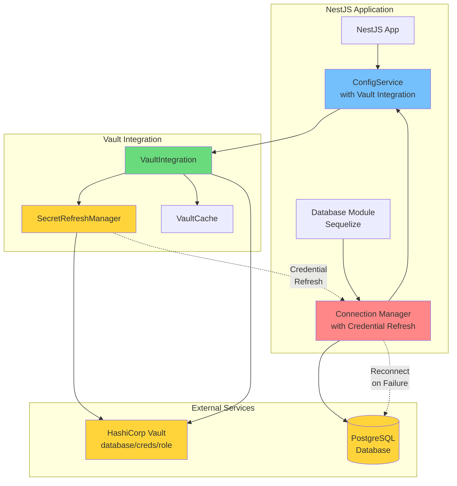
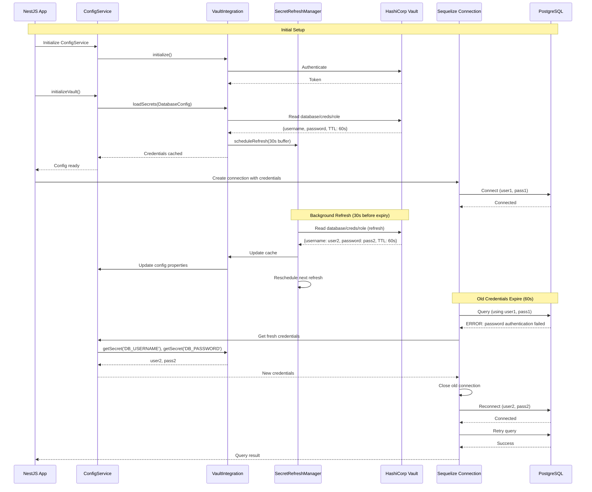

# NestJS + Sequelize + Vault Dynamic Secrets Integration Design

## Overview

This document designs a real-world integration test for Vault dynamic secrets with database reconnection in a NestJS application using Sequelize ORM.

**Scenario:**
- NestJS application using Sequelize to connect to PostgreSQL
- Database credentials come from Vault dynamic secrets (60s TTL)
- When password expires, Vault issues new credentials
- Sequelize reconnects with the NEW password from Configit
- Queries continue to work after original password expires

**Key Challenge:**
Sequelize stores the password at connection time. When Vault rotates credentials:
- The OLD user/password is revoked
- A NEW user/password is issued
- Sequelize must reconnect with the new credentials

---

## Architecture Diagram



---

## Sequence Diagram: Credential Rotation Flow



---

## Recommended Approach: Hybrid Strategy

After analyzing the three options, we recommend a **hybrid approach** combining:

1. **Password Getter Function** (Primary) - For proactive credential updates
2. **Connection Error Handler** (Fallback) - For reactive reconnection on auth failures
3. **Event Listener** (Optional) - For monitoring and logging

### Why This Approach?

- **Password Getter**: Allows Sequelize to fetch fresh credentials on each connection attempt
- **Error Handler**: Catches authentication failures when old credentials expire mid-operation
- **Event Listener**: Provides observability and metrics

---

## Option Analysis

### Option A: Password Getter Function

**How it works:**
- Sequelize supports a `password` option that can be a function
- Function is called whenever Sequelize needs credentials
- Configit provides fresh credentials synchronously from cache

**Pros:**
- ✅ Simple implementation
- ✅ Proactive - uses fresh credentials automatically
- ✅ No connection pool disruption
- ✅ Works with Sequelize connection pooling

**Cons:**
- ⚠️ Requires Sequelize 6.0+ (function support)
- ⚠️ Function called on every connection attempt (minor overhead)

**Implementation:**
```typescript
const sequelize = new Sequelize({
  database: configService.config.DB_NAME,
  username: configService.config.DB_USERNAME,
  password: () => configService.config.DB_PASSWORD, // Function!
  host: configService.config.DB_HOST,
  port: configService.config.DB_PORT,
  dialect: 'postgres',
  pool: {
    max: 5,
    min: 0,
    acquire: 30000,
    idle: 10000
  }
});
```

**Verdict:** ✅ **RECOMMENDED** - Best balance of simplicity and reliability

---

### Option B: Sequelize Connection Hooks

**How it works:**
- Use Sequelize `beforeConnect` hook to update credentials
- Hook runs before each new connection
- Configit provides fresh credentials from cache

**Pros:**
- ✅ Works with all Sequelize versions
- ✅ Centralized credential management
- ✅ Can add logging/metrics

**Cons:**
- ⚠️ More complex implementation
- ⚠️ Requires careful hook ordering
- ⚠️ May not catch mid-connection failures

**Implementation:**
```typescript
sequelize.addHook('beforeConnect', async (config: any) => {
  config.username = configService.config.DB_USERNAME;
  config.password = configService.config.DB_PASSWORD;
});
```

**Verdict:** ⚠️ **FALLBACK** - Good for older Sequelize versions

---

### Option C: Custom Connection Manager

**How it works:**
- Extend Sequelize's ConnectionManager
- Override connection creation logic
- Intercept credential usage

**Pros:**
- ✅ Full control over connection lifecycle
- ✅ Can implement sophisticated retry logic
- ✅ Works with any Sequelize version

**Cons:**
- ❌ High complexity
- ❌ Maintenance burden
- ❌ Overkill for this use case
- ❌ May break with Sequelize updates

**Verdict:** ❌ **NOT RECOMMENDED** - Over-engineering for this requirement

---

## Configit Notification Strategy

### Current Behavior

Configit's `SecretRefreshManager` automatically refreshes secrets before TTL expiry:
- **Refresh Buffer**: 30 seconds (configurable)
- **TTL**: 60 seconds
- **Refresh Trigger**: At 30 seconds (60s - 30s buffer)

### How Configit Notifies the App

**1. Synchronous Cache Access (Primary Method)**
```typescript
// Configit updates cache automatically
const username = configService.config.DB_USERNAME; // Always fresh from cache
const password = configService.config.DB_PASSWORD; // Always fresh from cache
```

**2. Event Emitter (Future Enhancement)**
```typescript
// Potential future API
vaultIntegration.on('secret-refreshed', (propertyName: string) => {
  if (propertyName === 'DB_PASSWORD') {
    sequelize.connectionManager.pool.drain();
  }
});
```

**3. Polling Refresh Status (Monitoring)**
```typescript
const health = vaultIntegration.getHealthDetails();
const dbPasswordStatus = health.refreshStatus.find(s => s.propertyName === 'DB_PASSWORD');
if (dbPasswordStatus.refreshCount > lastRefreshCount) {
  // Credentials were refreshed
}
```

**Recommendation:** Use synchronous cache access (method 1) - it's the simplest and most reliable.

---

## Reconnection Strategy

### Strategy: Retry with Fresh Credentials

When a query fails due to authentication errors:

1. **Detect Authentication Failure**
   - Catch Sequelize errors
   - Check for PostgreSQL auth error codes: `28P01` (invalid password)

2. **Get Fresh Credentials**
   - Query Configit for latest credentials
   - Verify credentials changed (optional check)

3. **Reconnect**
   - Close existing connection pool
   - Create new Sequelize instance with fresh credentials
   - Retry the failed query

4. **Exponential Backoff** (for transient failures)
   - Retry with increasing delays
   - Max retries: 3

### Error Detection

PostgreSQL authentication errors:
- Error code: `28P01`
- Error message: `password authentication failed for user`
- Sequelize error: `SequelizeConnectionError` or `SequelizeConnectionRefusedError`

### Implementation Pattern

```typescript
async function executeWithReconnect<T>(
  sequelize: Sequelize,
  queryFn: () => Promise<T>
): Promise<T> {
  let retries = 0;
  const maxRetries = 3;
  
  while (retries < maxRetries) {
    try {
      return await queryFn();
    } catch (error: any) {
      // Check if it's an authentication error
      if (isAuthError(error)) {
        if (retries >= maxRetries - 1) {
          throw error; // Give up after max retries
        }
        
        // Get fresh credentials
        const newUsername = configService.config.DB_USERNAME;
        const newPassword = configService.config.DB_PASSWORD;
        
        // Reconnect with new credentials
        await reconnectSequelize(sequelize, newUsername, newPassword);
        
        retries++;
        await sleep(Math.pow(2, retries) * 1000); // Exponential backoff
        continue;
      }
      
      // Not an auth error, rethrow
      throw error;
    }
  }
  
  throw new Error('Max retries exceeded');
}

function isAuthError(error: any): boolean {
  const message = error?.message || '';
  const code = error?.parent?.code || error?.code || '';
  
  return (
    code === '28P01' ||
    message.includes('password authentication failed') ||
    message.includes('authentication failed')
  );
}
```

---

## Complete Integration Pattern

### 1. Database Configuration Model

```typescript
import { IsString, IsNumber } from 'class-validator';
import { VaultPath, VaultKey, VaultEngine, VaultRefreshBuffer } from '@kibibit/configit';
import { BaseConfig } from '@kibibit/configit';

export class DatabaseConfig extends BaseConfig {
  @VaultPath('database/creds/configit-readonly')
  @VaultKey('username')
  @VaultEngine('database')
  @VaultRefreshBuffer(30) // Refresh 30s before expiry
  @IsString()
  DB_USERNAME!: string;

  @VaultPath('database/creds/configit-readonly')
  @VaultKey('password')
  @VaultEngine('database')
  @VaultRefreshBuffer(30)
  @IsString()
  DB_PASSWORD!: string;

  @IsString()
  DB_HOST: string = 'localhost';

  @IsNumber()
  DB_PORT: number = 5432;

  @IsString()
  DB_NAME: string = 'myapp';
}
```

### 2. Database Module (NestJS)

```typescript
import { Module, OnModuleInit, OnModuleDestroy } from '@nestjs/common';
import { SequelizeModule } from '@nestjs/sequelize';
import { ConfigService } from '@kibibit/configit';
import { DatabaseConfig } from './database.config';
import { Sequelize } from 'sequelize-typescript';

@Module({
  imports: [
    SequelizeModule.forRootAsync({
      useFactory: (configService: ConfigService<DatabaseConfig>) => {
        const config = configService.config;
        
        return {
          dialect: 'postgres',
          host: config.DB_HOST,
          port: config.DB_PORT,
          database: config.DB_NAME,
          username: config.DB_USERNAME,
          // Use function to get fresh password on each connection
          password: () => config.DB_PASSWORD,
          pool: {
            max: 5,
            min: 0,
            acquire: 30000,
            idle: 10000
          },
          // Retry configuration
          retry: {
            max: 3,
            match: [
              /ETIMEDOUT/,
              /EHOSTUNREACH/,
              /ECONNREFUSED/,
              /28P01/, // PostgreSQL authentication error
            ]
          },
          // Logging (optional)
          logging: (sql: string) => {
            console.log('[Sequelize]', sql);
          }
        };
      },
      inject: [ConfigService]
    })
  ]
})
export class DatabaseModule implements OnModuleInit, OnModuleDestroy {
  constructor(
    private readonly sequelize: Sequelize,
    private readonly configService: ConfigService<DatabaseConfig>
  ) {}

  async onModuleInit() {
    // Test connection
    await this.sequelize.authenticate();
    console.log('Database connection established');
    
    // Setup error handler for auth failures
    this.setupAuthErrorHandler();
  }

  async onModuleDestroy() {
    await this.sequelize.close();
  }

  private setupAuthErrorHandler() {
    // Listen for connection errors
    this.sequelize.connectionManager.pool.on('error', async (error: any) => {
      if (this.isAuthError(error)) {
        console.warn('Authentication error detected, reconnecting...');
        await this.reconnect();
      }
    });
  }

  private isAuthError(error: any): boolean {
    const message = error?.message || '';
    const code = error?.parent?.code || error?.code || '';
    
    return (
      code === '28P01' ||
      message.includes('password authentication failed') ||
      message.includes('authentication failed')
    );
  }

  private async reconnect(): Promise<void> {
    try {
      // Get fresh credentials
      const config = this.configService.config;
      const newUsername = config.DB_USERNAME;
      const newPassword = config.DB_PASSWORD;
      
      // Close existing connections
      await this.sequelize.connectionManager.pool.drain();
      await this.sequelize.connectionManager.pool.clear();
      
      // Update connection config
      (this.sequelize.config as any).username = newUsername;
      (this.sequelize.config as any).password = newPassword;
      
      // Reconnect
      await this.sequelize.connectionManager.pool.initialize();
      console.log('Database reconnected with fresh credentials');
    } catch (error) {
      console.error('Failed to reconnect:', error);
      throw error;
    }
  }
}
```

### 3. Application Bootstrap

```typescript
import { NestFactory } from '@nestjs/core';
import { AppModule } from './app.module';
import { ConfigService } from '@kibibit/configit';
import { DatabaseConfig } from './database.config';

async function bootstrap() {
  const app = await NestFactory.createApplicationContext(AppModule);
  
  // Initialize ConfigService
  const configService = new ConfigService(DatabaseConfig, undefined, {
    vault: {
      endpoint: process.env.VAULT_ADDR || 'http://127.0.0.1:8200',
      auth: {
        methods: [{
          type: 'token',
          config: {
            type: 'token',
            token: process.env.VAULT_TOKEN || 'configit-dev-token'
          }
        }]
      },
      tls: { enabled: false, verifyCertificate: false },
      refreshBuffer: 30 // Refresh 30s before expiry
    }
  });
  
  // Initialize Vault (async)
  await configService.initializeVault();
  console.log('Vault integration initialized');
  
  // App is ready
  await app.init();
}

bootstrap();
```

### 4. Service with Query Retry

```typescript
import { Injectable } from '@nestjs/common';
import { InjectModel } from '@nestjs/sequelize';
import { Sequelize } from 'sequelize-typescript';
import { ConfigService } from '@kibibit/configit';
import { DatabaseConfig } from './database.config';
import { User } from './user.model';

@Injectable()
export class UserService {
  constructor(
    @InjectModel(User)
    private readonly userModel: typeof User,
    private readonly sequelize: Sequelize,
    private readonly configService: ConfigService<DatabaseConfig>
  ) {}

  async findAll(): Promise<User[]> {
    return this.executeWithReconnect(async () => {
      return this.userModel.findAll();
    });
  }

  private async executeWithReconnect<T>(
    queryFn: () => Promise<T>,
    retries = 3
  ): Promise<T> {
    for (let attempt = 0; attempt < retries; attempt++) {
      try {
        return await queryFn();
      } catch (error: any) {
        if (this.isAuthError(error) && attempt < retries - 1) {
          console.warn(`Auth error on attempt ${attempt + 1}, reconnecting...`);
          await this.reconnect();
          await this.sleep(Math.pow(2, attempt) * 1000); // Exponential backoff
          continue;
        }
        throw error;
      }
    }
    throw new Error('Max retries exceeded');
  }

  private isAuthError(error: any): boolean {
    const message = error?.message || '';
    const code = error?.parent?.code || error?.code || '';
    
    return (
      code === '28P01' ||
      message.includes('password authentication failed') ||
      message.includes('authentication failed')
    );
  }

  private async reconnect(): Promise<void> {
    const config = this.configService.config;
    
    // Close pool
    await this.sequelize.connectionManager.pool.drain();
    await this.sequelize.connectionManager.pool.clear();
    
    // Update config
    (this.sequelize.config as any).username = config.DB_USERNAME;
    (this.sequelize.config as any).password = config.DB_PASSWORD;
    
    // Reinitialize pool
    await this.sequelize.connectionManager.pool.initialize();
  }

  private sleep(ms: number): Promise<void> {
    return new Promise(resolve => setTimeout(resolve, ms));
  }
}
```

---

## Testing Strategy

### Integration Test Flow

1. **Setup Phase**
   - Start Vault and PostgreSQL (docker-compose)
   - Configure Vault database secrets engine
   - Create NestJS app with Configit integration

2. **Initial Connection**
   - Initialize ConfigService with Vault
   - Load database credentials (user1, pass1)
   - Establish Sequelize connection
   - Verify connection works

3. **Credential Rotation**
   - Wait for Vault TTL expiry (60s) or trigger refresh
   - Configit refreshes credentials (user2, pass2)
   - Old credentials (user1, pass1) are revoked by Vault

4. **Reconnection Test**
   - Execute query with old credentials
   - Detect authentication failure
   - Reconnect with new credentials (user2, pass2)
   - Verify query succeeds

5. **Continuous Operation**
   - Execute multiple queries over time
   - Verify automatic reconnection on each credential rotation
   - Monitor refresh cycles

### Test Scenarios

**Scenario 1: Proactive Refresh (Happy Path)**
- Configit refreshes credentials 30s before expiry
- Sequelize uses password getter function
- New connections use fresh credentials automatically
- No authentication errors occur

**Scenario 2: Reactive Reconnection (Fallback)**
- Old credentials expire before refresh completes
- Query fails with authentication error
- Error handler detects failure
- Reconnects with fresh credentials
- Query retries successfully

**Scenario 3: Concurrent Connections**
- Multiple Sequelize connections active
- Credentials rotate mid-operation
- Each connection handles reconnection independently
- No connection pool corruption

**Scenario 4: Refresh Failure**
- Vault unavailable during refresh
- Configit retries with exponential backoff
- Uses cached credentials until refresh succeeds
- Graceful degradation

---

## Performance Considerations

### Overhead Analysis

1. **Password Getter Function**
   - Called on each new connection (not every query)
   - Synchronous cache lookup: ~0.1ms
   - Negligible impact

2. **Connection Pooling**
   - Pool reuses connections
   - Password getter only called for new connections
   - Minimal overhead

3. **Refresh Frequency**
   - Refresh every 30 seconds (60s TTL - 30s buffer)
   - Background operation, no query blocking
   - Acceptable for production

### Optimization Recommendations

1. **Connection Pool Size**
   - Set `max` to match application concurrency
   - Prevents excessive connection creation
   - Reduces password getter calls

2. **Refresh Buffer Tuning**
   - Increase buffer for high-traffic apps (45s buffer for 60s TTL)
   - Reduces risk of mid-operation failures
   - Trade-off: More frequent refreshes

3. **Monitoring**
   - Track refresh frequency
   - Monitor authentication errors
   - Alert on excessive reconnections

---

## Security Considerations

### Credential Handling

1. **In-Memory Storage**
   - Credentials stored in Configit cache (memory)
   - Never logged or exposed
   - Cleared on application shutdown

2. **Network Security**
   - Vault communication over TLS (production)
   - Database connections encrypted (SSL)
   - Credentials never transmitted in plaintext

3. **Credential Rotation**
   - Old credentials revoked immediately
   - New credentials issued before expiry
   - Zero-downtime rotation

### Best Practices

1. **Least Privilege**
   - Vault role grants minimal required permissions
   - Database user has read-only access (if applicable)
   - Principle of least privilege

2. **Audit Logging**
   - Log credential refresh events (sanitized)
   - Monitor authentication failures
   - Track reconnection events

3. **Error Handling**
   - Never log credentials in error messages
   - Sanitize error output
   - Fail securely (don't expose internals)

---

## Monitoring & Observability

### Key Metrics

1. **Credential Refresh**
   - Refresh frequency
   - Refresh success/failure rate
   - Time between refresh and expiry

2. **Database Connections**
   - Connection pool size
   - Active connections
   - Connection errors

3. **Reconnection Events**
   - Reconnection frequency
   - Reconnection success rate
   - Time to reconnect

### Logging Strategy

```typescript
// Log credential refresh (sanitized)
logger.info('Database credentials refreshed', {
  username: config.DB_USERNAME, // Safe to log
  refreshCount: health.refreshStatus.find(s => s.propertyName === 'DB_PASSWORD')?.refreshCount,
  timeUntilExpiry: '30s'
});

// Log reconnection events
logger.warn('Database reconnection triggered', {
  reason: 'authentication_failure',
  attempt: retryCount,
  success: true
});
```

---

## Troubleshooting Guide

### Common Issues

**Issue 1: Credentials Not Refreshing**
- **Symptom**: Authentication errors after TTL expiry
- **Cause**: Refresh manager not running or misconfigured
- **Solution**: Check `refreshBuffer` configuration, verify Vault connectivity

**Issue 2: Reconnection Loop**
- **Symptom**: Continuous reconnection attempts
- **Cause**: Credentials invalid or Vault unavailable
- **Solution**: Check Vault health, verify role permissions

**Issue 3: Connection Pool Exhaustion**
- **Symptom**: "Too many connections" errors
- **Cause**: Pool not draining on reconnect
- **Solution**: Ensure `pool.drain()` called before reconnection

**Issue 4: Stale Credentials**
- **Symptom**: Using old credentials after refresh
- **Cause**: ConfigService cache not updated
- **Solution**: Verify `targetInstance` passed to refresh manager

---

## Conclusion

The recommended approach combines:

1. **Password Getter Function** - Proactive credential updates
2. **Error Handler** - Reactive reconnection on failures
3. **Configit Integration** - Automatic credential refresh

This hybrid strategy provides:
- ✅ Zero-downtime credential rotation
- ✅ Automatic reconnection on failures
- ✅ Simple implementation
- ✅ Production-ready reliability

The integration is **simple to implement**, **reliable in production**, and **maintainable** over time.

---

## References

- [Sequelize Connection Options](https://sequelize.org/docs/v6/core-concepts/connection-pool/)
- [Vault Database Secrets Engine](https://www.vaultproject.io/docs/secrets/databases)
- [Configit Vault Integration](../docs/vault-integration/)
- [NestJS Sequelize Module](https://docs.nestjs.com/techniques/database#sequelize-integration)
